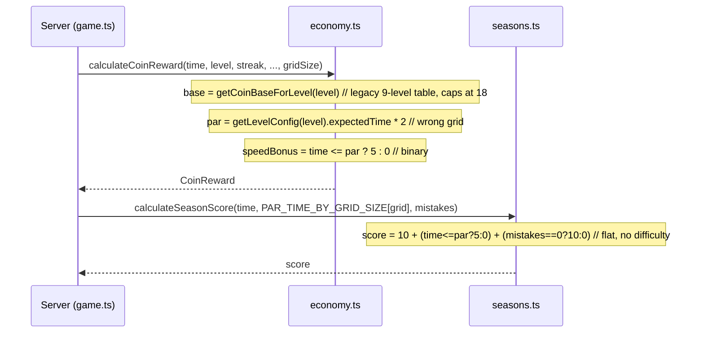
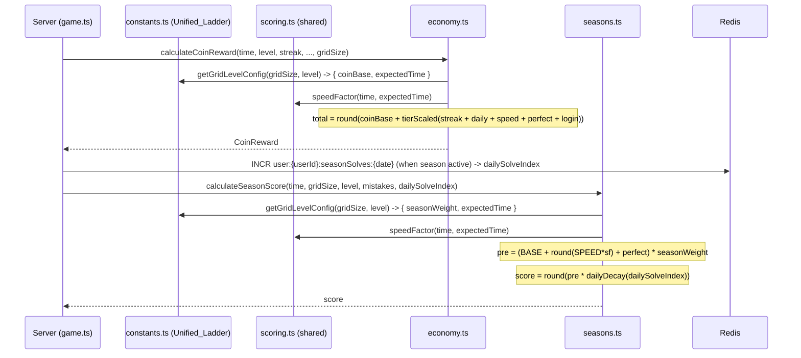

# Design Document: Difficulty-Weighted Scoring

## Overview

This feature consolidates all per-bucket scoring onto one authored table and fixes the cross-wired legacy lookups. The guiding principle, drawn from how Candy Crush handles its discrete, finite content (versus chess.com's formula-driven continuous rating): **author the 12 difficulty buckets as a hand-tuned table, and use thin formulas only for the genuinely continuous inputs — solve time and daily solve count.**

Concretely, this change:

1. Extends the existing `PER_GRID_LADDER` (the Unified_Ladder) with two authored columns: `coinBase` and `seasonWeight`.
2. Rewrites `calculateCoinReward` to read `coinBase` from the table and derive Par_Time from `expectedTime`, removing the legacy `getCoinBaseForLevel` / `getLevelConfig` / `PAR_TIME_MULTIPLIER` path.
3. Introduces a single shared `speedFactor` pure function (continuous formula on time) used by both coins and seasons, replacing the binary speed bonus.
4. Rewrites `calculateSeasonScore` to weight points by `seasonWeight`, use the graduated speed component, and apply a continuous `dailyDecay` formula based on the player's Daily_Solve_Index.
5. Adds a per-user-per-day season solve counter in Redis to drive the decay.

The two currencies are deliberately given different jobs: **coins** reward engagement (volume is fine; bigger puzzles pay a mild per-minute premium), while **season points** reward skill (difficulty-weighted, with soft diminishing returns on grinding).

Out of scope (tracked separately): coin sink / inflation control, unified cross-grid progression, global multiplier-stack cap, and changes to the adaptive difficulty engine (`adaptive.ts` already uses `getGridLevelConfig` correctly).

## Architecture

### Current Flow (scoring portion of `POST /api/game/complete`)



### New Flow



### Key Architectural Decisions

1. **Table-first, formula-thin.** The 12 discrete buckets are authored constants. Only `speedFactor` (continuous in time) and `dailyDecay` (continuous in solve count) are formulas. This is the explicit takeaway from comparing Candy Crush (authored discrete content) and chess.com (formula-driven continuous rating): Urjo is structurally a Candy Crush.

2. **One shared `speedFactor` function.** Both currencies need a graduated speed measure off the same Par_Time. Extracting it to `src/shared/scoring.ts` guarantees they stay consistent and is trivially unit-testable.

3. **`coinBase` is an absolute authored value, not `baseUnit × multiplier`.** This folds the old `GRID_SIZE_MULTIPLIERS` effect into the table so there is exactly one number per bucket to tune. The `gridSizeMultiplier` field stays in the response for display only.

4. **Daily decay is server-side and continuous.** A simple per-day Redis counter drives a linear decay with a floor. No hard cap, so extended play always earns something — preserving the play-time goal while removing the "grinding easy puzzles is optimal" exploit on the leaderboard.

5. **Adaptive engine untouched.** `calculatePerformanceScore` / `calculateSkipScore` already use `getGridLevelConfig`. Leaving them alone keeps this change surgical.

## Components and Interfaces

### Shared Constants (`src/shared/constants.ts`)

The `GridDifficultyLevel` type gains two fields, and `PER_GRID_LADDER` gains the authored columns.

```typescript
export type GridDifficultyLevel = {
  level: number
  gridSize: GridSize
  difficulty: Difficulty
  expectedTime: number   // seconds — Par_Time source (existing)
  coinBase: number       // NEW: authored absolute base coin reward
  seasonWeight: number   // NEW: authored season-point difficulty multiplier
}
```

**Authored Unified_Ladder values** (seeded from a ~0.22 coins/sec per-minute-neutral heuristic with a mild cross-grid tilt for `coinBase`, and a compressed curve for `seasonWeight`; all free to tune):

| Grid | Level | Difficulty | expectedTime | coinBase | seasonWeight | coins/min |
|------|-------|------------|--------------|----------|--------------|-----------|
| 4×4  | 1 | easy       | 45  | 10  | 1.0 | 13.3 |
| 4×4  | 2 | medium     | 90  | 20  | 1.3 | 13.3 |
| 4×4  | 3 | hard       | 150 | 33  | 1.6 | 13.2 |
| 4×4  | 4 | diabolical | 210 | 46  | 1.9 | 13.1 |
| 6×6  | 1 | easy       | 120 | 50  | 2.0 | 25.0 |
| 6×6  | 2 | medium     | 210 | 64  | 2.2 | 18.3 |
| 6×6  | 3 | hard       | 360 | 83  | 2.4 | 13.8 |
| 6×6  | 4 | diabolical | 480 | 111 | 2.6 | 13.9 |
| 8×8  | 1 | easy       | 300 | 120 | 2.8 | 24.0 |
| 8×8  | 2 | medium     | 480 | 150 | 3.2 | 18.75 |
| 8×8  | 3 | hard       | 720 | 188 | 3.6 | 15.7 |
| 8×8  | 4 | diabolical | 960 | 232 | 4.0 | 14.5 |

Notes for tuning:
- `coinBase` is authored for strict cross-grid monotonicity along the unified order, so a larger grid's entry bucket necessarily pays a higher per-minute rate than the previous grid's hardest bucket (e.g. 6×6 easy at 25.0 coins/min vs 4×4 diabolical at 13.1). Per-minute rates therefore vary by design rather than holding a fixed band. This raises absolute payouts for big grids; inflation is addressed by the separately-scoped coin sink, not by compressing this column.
- `seasonWeight` is deliberately compressed (8×8 diabolical ≈ 4× a 4×4 easy, not ~21×) so the leaderboard rewards difficulty without letting one long solve dominate.
- `getGridLevelConfig(gridSize, level)` already exists and returns the full row; no signature change.

`COIN_BASE`, `COINS_BY_LEVEL`, `getCoinBaseForLevel`, `getLevelConfig`, `PAR_TIME_MULTIPLIER`, `DIFFICULTY_LADDER`, and `GRID_SIZE_MULTIPLIERS` are removed if unreferenced after this change, or marked `@deprecated` if still used by out-of-scope code. (`GRID_SIZE_MULTIPLIERS` is retained only if still needed for the display field.)

### Shared Scoring (`src/shared/scoring.ts`) — NEW

```typescript
/**
 * Continuous speed measure in [0, 1].
 * 0 when time >= par; approaches 1 as time -> 0.
 */
export const speedFactor = (timeTaken: number, parTime: number): number

/** Daily diminishing-returns factor for the n-th season-counted solve. */
export const dailyDecay = (dailySolveIndex: number): number

export const MAX_SPEED_COIN_BONUS: number   // e.g. 8
export const DAILY_DECAY_STEP: number        // e.g. 0.1
export const DAILY_DECAY_FLOOR: number       // e.g. 0.4
```

`speedFactor` and `dailyDecay` are pure. `dailyDecay(n) = max(FLOOR, 1 − STEP × (n − 1))`, clamped to ≤ 1.0, with `n` treated as ≥ 1.

### Shared Constants for Season (`src/shared/growth-constants.ts`)

`SEASON_BASE_POINTS`, `SEASON_SPEED_BONUS`, `SEASON_PERFECT_BONUS` remain. `SEASON_SPEED_BONUS` is now the *maximum* graduated speed component rather than a flat threshold bonus.

### Economy (`src/server/lib/economy.ts`)

`calculateCoinReward` keeps its existing signature `(timeTaken, level, currentStreak, isDailyFirst, mistakes, consecutiveLoginDays, gridSize)`. Internally:

```typescript
const config = getGridLevelConfig(gridSize, level)   // { coinBase, expectedTime, ... }
const base = config.coinBase
const sf = speedFactor(timeTaken, config.expectedTime)
const speedBonusRaw = Math.round(MAX_SPEED_COIN_BONUS * sf)
const perfectBonusRaw = mistakes === 0 ? COIN_PERFECT_BONUS : 0
// streak / login / daily unchanged
const tierMultiplier = getTierBonusMultiplier(getResultTier(mistakes, gridSize).id)
// tier-scale the pool (daily stays full), sum, then:
const total = Math.round(base + scaledBonusPool)
return { base, ..., gridSizeMultiplier: GRID_SIZE_MULTIPLIERS[gridSize], total, tierId, tierMultiplier }
```

The `speedSolves` increment in the route still keys off `speedBonus > 0`, which now means "beat par at all" (Speed_Factor > 0) — equivalent intent.

### Seasons (`src/server/lib/seasons.ts`)

`calculateSeasonScore` signature changes from `(timeTaken, parTime, mistakes)` to:

```typescript
export const calculateSeasonScore = (
  timeTaken: number,
  gridSize: GridSize,
  level: number,
  mistakes: number,
  dailySolveIndex: number,
): number
```

Implementation:

```typescript
const config = getGridLevelConfig(gridSize, level)
const sf = speedFactor(timeTaken, config.expectedTime)
const speedComponent = Math.round(SEASON_SPEED_BONUS * sf)
const perfectComponent = mistakes === 0 ? SEASON_PERFECT_BONUS : 0
const preDecay = (SEASON_BASE_POINTS + speedComponent + perfectComponent) * config.seasonWeight
return Math.round(preDecay * dailyDecay(dailySolveIndex))
```

`recordSeasonScore`, leaderboard reads, recap, and reward payout are unchanged.

### Server Route (`src/server/routes/game.ts`)

In `POST /api/game/complete` (logged-in season block) and the analogous block in `POST /api/game/migrate-logged-out-score`:

- Replace `getParTimeForGrid(gridSize)` usage. Remove the local `PAR_TIME_BY_GRID_SIZE` table and `getParTimeForGrid` helper.
- When a season is active, atomically increment `user:{userId}:seasonSolves:{date}` (with `expire` ≥ 172800s) to obtain `dailySolveIndex`, then call `calculateSeasonScore(timeTaken, gridSize, currentLevel, mistakes, dailySolveIndex)`.
- The migrate-logged-out path uses `dailySolveIndex` from the same counter (the solve happened off-platform but is being credited now).

## Data Models

### Redis Key Schema

| Key Pattern | Type | Description |
|-------------|------|-------------|
| `user:{userId}:seasonSolves:{date}` | string (int) | NEW. Daily_Solve_Index counter, TTL ≥ 48h. Incremented once per season-counted completion. |

All other keys (economy hash, season leaderboard, speed leaderboards) are unchanged.

## Correctness Properties

*A property is a characteristic or behavior that should hold true across all valid executions of a system.*

### Property 1: Coin base is monotonic along the unified difficulty order

*For any* two buckets A and B where A precedes B in the unified order (4×4 L1→L4, 6×6 L1→L4, 8×8 L1→L4), `coinBase(A) < coinBase(B)`.

**Validates: Requirements 2.1**

### Property 2: Bigger grids hold a per-minute coin advantage

*For* the easiest bucket (4×4 easy), `coinBase/expectedTime` SHALL be less than or equal to that of the hardest bucket (8×8 diabolical).

**Validates: Requirements 2.3**

### Property 3: Coin reward total is always a non-negative integer

*For any* valid completion parameters (timeTaken 1–9999, level 1–4, streak 0–500, isDailyFirst bool, mistakes 0–20, loginDays 0–60) and *any* valid grid size, `calculateCoinReward(...).total` SHALL satisfy `Number.isInteger(total)` and `total >= 0`.

**Validates: Requirements 2.4**

### Property 4: Speed factor is bounded and monotonic in time

*For any* `parTime > 0` and *any* `timeTaken >= 0`, `speedFactor(timeTaken, parTime)` SHALL be in [0, 1], SHALL equal 0 when `timeTaken >= parTime`, and SHALL be non-increasing as `timeTaken` increases.

**Validates: Requirements 3.1, 3.2, 3.3**

### Property 5: Season weight is monotonic and anchored

*For any* two buckets A and B where A precedes B in the unified order, `seasonWeight(A) < seasonWeight(B)`; and `seasonWeight(4×4, 1) === 1.0`.

**Validates: Requirements 4.3**

### Property 6: Daily decay is bounded, starts at 1.0, and never zeroes out

*For any* integer `dailySolveIndex >= 1`, `dailyDecay(index)` SHALL be in `[DAILY_DECAY_FLOOR, 1.0]`, SHALL equal 1.0 when index is 1, and SHALL be non-increasing as index increases.

**Validates: Requirements 5.2, 5.3, 5.4, 5.5**

### Property 7: Season score is a non-negative integer that respects decay ordering

*For any* fixed (timeTaken, gridSize, level, mistakes) and two indices i < j, `calculateSeasonScore(..., i) >= calculateSeasonScore(..., j)`, and both SHALL be non-negative integers.

**Validates: Requirements 4.5, 5.5**

## Error Handling

| Scenario | Behavior |
|----------|----------|
| `level` out of [1,4] passed to `getGridLevelConfig` | Existing clamping applies; returns a valid bucket row. |
| `parTime <= 0` in `speedFactor` | Guard: return 0 (no divide-by-zero; no speed bonus). |
| `dailySolveIndex < 1` or non-finite | Treated as 1 (full value). |
| Redis INCR failure for season counter | Caught within the existing non-blocking season `try/catch`; season scoring is skipped for that completion, completion still succeeds. Counter is best-effort. |
| Season inactive | No counter increment, no season score recorded (unchanged behavior). |
| Logged-out completion | No userId; season block is skipped entirely, as today. |

## Testing Strategy

### Property-Based Tests

- **Library:** fast-check with Vitest.
- **Minimum iterations:** 100 per property.
- **Tag format:** `Feature: difficulty-weighted-scoring, Property {N}: {description}`

| Property | Function Under Test | Generator Strategy |
|----------|--------------------|--------------------|
| 1: coinBase monotonic | `PER_GRID_LADDER` | Exhaustive over the 12 buckets in unified order |
| 2: per-minute advantage | `PER_GRID_LADDER` | Compare 4×4-easy vs 8×8-diabolical |
| 3: integer non-negative total | `calculateCoinReward` | Random params across all 3 grid sizes |
| 4: speedFactor bounds/monotonic | `speedFactor` | Random parTime 1–2000, timeTaken 0–4000; monotonic via sorted pairs |
| 5: seasonWeight monotonic/anchored | `PER_GRID_LADDER` | Exhaustive over 12 buckets |
| 6: dailyDecay bounds | `dailyDecay` | Random index 1–100 |
| 7: season score decay ordering | `calculateSeasonScore` | Random completion params × index pairs i<j |

### Unit Tests (Example-Based)

| Area | Test Cases |
|------|-----------|
| `getGridLevelConfig` | Returns authored `coinBase` and `seasonWeight` for sample buckets (4×4 L1 → coinBase 10, seasonWeight 1.0; 8×8 L4 → coinBase 232, seasonWeight 4.0) |
| `speedFactor` | par=100,time=50 → 0.5; time=0 → 1.0; time=100 → 0; time=150 → 0; par=0 → 0 |
| `dailyDecay` | index 1 → 1.0; index 2 → 0.9; index 7 → 0.4 (floor); index 20 → 0.4 |
| `calculateCoinReward` | 4×4 L1 base=10; 8×8 L4 base=232; graduated speed bonus scales with time; tier multiplier still scales bonus pool; daily bonus unscaled |
| `calculateSeasonScore` | Flawless fast 8×8 L4 >> flawless fast 4×4 L1; decay reduces repeated-solve score; perfect/speed components applied; integer output |

### Integration Tests

| Flow | What's Verified |
|------|----------------|
| Complete 6×6 vs 4×4 | 6×6 completion records more coins and more season points than an equivalent 4×4 completion |
| Repeated solves same day | 2nd/3rd season-counted solve records progressively fewer season points; never zero |
| Season inactive | No `seasonSolves` counter written; completion still succeeds |
| Logged-out complete | No season counter, no errors |
| Legacy lookups removed | No scoring path references `getCoinBaseForLevel` / `getLevelConfig` / `PAR_TIME_BY_GRID_SIZE` (grep-style assertion or removal) |

### What's NOT Tested

- Exact balance/tuning of authored numbers (a playtest concern, not a correctness concern).
- Downstream session-run / weekend / variable-reward multipliers (covered by existing tests; unchanged here).
- Adaptive difficulty engine (out of scope; unchanged).
