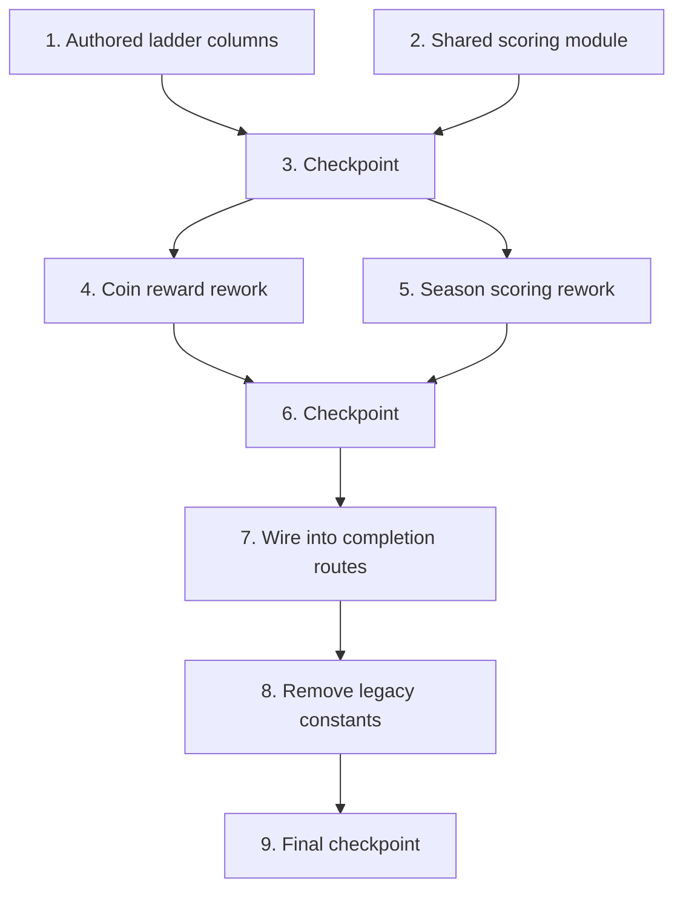

# Implementation Plan: Difficulty-Weighted Scoring

## Overview

Consolidate all per-bucket scoring onto the authored Unified_Ladder (`PER_GRID_LADDER`), fix the legacy cross-wired lookups, and make both currencies difficulty-aware: coins get a mild per-minute depth nudge, season points get difficulty weighting plus soft daily diminishing returns. Continuous inputs (solve time, daily solve count) use thin shared formulas; the 12 discrete buckets are hand-authored.

## Task Dependency Graph



- Tasks 1 and 2 are independent and can be done in parallel.
- Tasks 4 and 5 both depend on the ladder columns (1) and shared module (2), and are independent of each other.
- Task 7 depends on both 4 and 5 being complete.
- Task 8 (legacy removal) runs last before final verification to avoid breaking intermediate states.

```json
{
  "waves": [
    { "wave": 1, "tasks": ["1", "2"], "parallel": true },
    { "wave": 2, "tasks": ["3"], "parallel": false },
    { "wave": 3, "tasks": ["4", "5"], "parallel": true },
    { "wave": 4, "tasks": ["6"], "parallel": false },
    { "wave": 5, "tasks": ["7"], "parallel": false },
    { "wave": 6, "tasks": ["8"], "parallel": false },
    { "wave": 7, "tasks": ["9"], "parallel": false }
  ]
}
```

## Tasks

- [x] 1. Extend the Unified_Ladder with authored scoring columns
  - [x] 1.1 Add `coinBase` and `seasonWeight` to `GridDifficultyLevel` and populate all 12 `PER_GRID_LADDER` buckets in `src/shared/constants.ts`
    - Use the authored values from the design table; add a comment noting they are seeded from a time-proportional heuristic and free to tune
    - _Requirements: 1.1, 1.6, 2.1, 2.2, 4.3_
  - [x] 1.2 Write property tests for `coinBase` monotonicity and per-minute advantage (Properties 1, 2)
    - **Property 1: Coin base is monotonic along the unified difficulty order**
    - **Property 2: Bigger grids hold a per-minute coin advantage**
    - **Validates: Requirements 2.1, 2.3**
  - [x] 1.3 Write property tests for `seasonWeight` monotonicity and anchor (Property 5)
    - **Property 5: Season weight is monotonic and anchored**
    - **Validates: Requirements 4.3**

- [x] 2. Create the shared continuous-input scoring module
  - [x] 2.1 Create `src/shared/scoring.ts` with `speedFactor`, `dailyDecay`, and the `MAX_SPEED_COIN_BONUS` / `DAILY_DECAY_STEP` / `DAILY_DECAY_FLOOR` constants
    - `speedFactor(time, par) = clamp((par - time)/par, 0, 1)`, guarding `par <= 0` → 0
    - `dailyDecay(n) = max(FLOOR, 1 - STEP*(n-1))`, clamped ≤ 1.0, treating n < 1 as 1
    - _Requirements: 3.1, 3.2, 3.3, 3.6, 5.2, 5.3, 5.4, 5.5_
  - [x] 2.2 Write property tests for `speedFactor` and `dailyDecay` (Properties 4, 6)
    - **Property 4: Speed factor is bounded and monotonic in time**
    - **Property 6: Daily decay is bounded, starts at 1.0, and never zeroes out**
    - **Validates: Requirements 3.1, 3.2, 3.3, 5.2, 5.3, 5.4, 5.5**
  - [x] 2.3 Write unit tests for `speedFactor` and `dailyDecay` edge cases
    - speedFactor: par=100/time=50→0.5, time=0→1, time≥par→0, par=0→0
    - dailyDecay: 1→1.0, 2→0.9, 7→0.4 (floor), 20→0.4
    - _Requirements: 3.2, 3.3, 5.3, 5.4_

- [x] 3. Checkpoint - Ensure all tests pass
  - Run `bun run test && bun run type-check`. Ask the user if questions arise.

- [x] 4. Rework coin reward to use the authored table and graduated speed
  - [x] 4.1 Update `calculateCoinReward` in `src/server/lib/economy.ts`
    - Read `base` from `getGridLevelConfig(gridSize, level).coinBase`
    - Compute speed bonus via `speedFactor(timeTaken, config.expectedTime)` × `MAX_SPEED_COIN_BONUS`
    - Keep the Result_Tier scaling of the bonus pool and the unscaled daily bonus
    - Remove `getCoinBaseForLevel`, `getLevelConfig`, `PAR_TIME_MULTIPLIER` usage; retain `gridSizeMultiplier` field for display
    - _Requirements: 1.2, 1.3, 2.4, 2.5, 3.4, 6.1_
  - [x] 4.2 Write property tests for coin total (Property 3)
    - **Property 3: Coin reward total is always a non-negative integer**
    - **Validates: Requirements 2.4**
  - [x] 4.3 Write unit tests for updated `calculateCoinReward`
    - 4×4 L1 base=10; 8×8 L4 base=232; graduated speed scales with time; tier multiplier still scales the pool; daily bonus unscaled
    - _Requirements: 2.2, 2.4, 3.4, 6.1_

- [x] 5. Rework season scoring for difficulty weight and daily decay
  - [x] 5.1 Update `calculateSeasonScore` in `src/server/lib/seasons.ts` to the new signature `(timeTaken, gridSize, level, mistakes, dailySolveIndex)`
    - Use `seasonWeight` and `expectedTime` from `getGridLevelConfig`, graduated speed component, and `dailyDecay`
    - _Requirements: 1.4, 4.1, 4.2, 4.5, 5.5_
  - [x] 5.2 Write property tests for season score (Property 7)
    - **Property 7: Season score is a non-negative integer that respects decay ordering**
    - **Validates: Requirements 4.5, 5.5**
  - [x] 5.3 Write unit tests for `calculateSeasonScore`
    - Flawless fast 8×8 L4 >> flawless fast 4×4 L1; decay reduces repeated solves; integer output
    - _Requirements: 4.1, 4.2, 4.5_

- [x] 6. Checkpoint - Ensure all tests pass
  - Run `bun run test && bun run type-check`. Ask the user if questions arise.

- [x] 7. Wire the new scoring into the completion routes
  - [x] 7.1 Update the season block in `POST /api/game/complete` in `src/server/routes/game.ts`
    - Remove the local `PAR_TIME_BY_GRID_SIZE` table and `getParTimeForGrid` helper
    - When the season is active, atomically `INCR user:{userId}:seasonSolves:{date}` (set `expire` ≥ 172800s) to get `dailySolveIndex`, then call the new `calculateSeasonScore`
    - Keep the whole season block within its existing non-blocking try/catch
    - _Requirements: 5.1, 5.6, 1.4_
  - [x] 7.2 Update the season block in `POST /api/game/migrate-logged-out-score`
    - Use the same `seasonSolves` counter + new `calculateSeasonScore` signature
    - _Requirements: 5.1, 6.5_
  - [x] 7.3 Write integration tests for the reworked completion flow
    - 6×6 completion records more coins and season points than an equivalent 4×4
    - Repeated same-day season-counted solves award progressively fewer (never zero) points
    - Season inactive → no counter written, completion succeeds
    - Logged-out completion → no counter, no errors
    - _Requirements: 4.1, 5.1, 5.5, 5.6, 6.5_

- [x] 8. Remove or deprecate the dead legacy scoring constants
  - [x] 8.1 Remove `getCoinBaseForLevel`, `COIN_BASE`, `COINS_BY_LEVEL`, `PAR_TIME_MULTIPLIER`, and (if unreferenced) `getLevelConfig` / `DIFFICULTY_LADDER` / `GRID_SIZE_MULTIPLIERS` from `src/shared/constants.ts`
    - If any remain referenced by out-of-scope code, mark `@deprecated` instead of removing
    - Clean up now-unused imports created by this change
    - _Requirements: 1.5_
  - [x] 8.2 Verify no scoring path references the removed legacy helpers
    - grep-style assertion in tests, or confirm via `bun run type-check`
    - _Requirements: 1.2, 1.4, 1.5_

- [x] 9. Final checkpoint - Full verification
  - Run `bun run test && bun run type-check`. Ensure zero failures and zero type errors. Ask the user if questions arise.

## Notes

- Property tests use fast-check (≥100 iterations) and validate the universal correctness properties from the design.
- Unit tests cover specific authored values and edge cases; integration tests cover the route wiring.
- The authored `coinBase` / `seasonWeight` numbers are tunable starting values — balance tuning is a playtest activity, not a correctness gate.
- Out of scope (separate specs): coin sink / inflation control, unified cross-grid progression ladder, global multiplier-stack cap, adaptive engine changes.
- Run `bun run test` after each implementation task per the TDD workflow.
