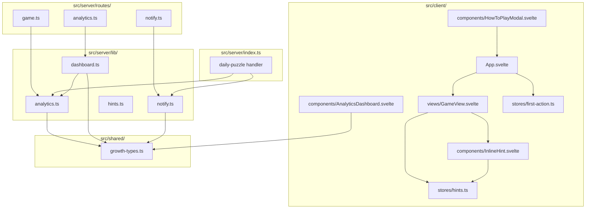

# Design Document: Funnel Truth and Trigger

## Overview

This is a one-week corrective bundling three coordinated workstreams that respond to a triple-KILL alert on the Urjo growth dashboard. Investigation revealed the alerts were poisoned by an instrumentation gap: the client never POSTs to the existing `/api/game/first-action` endpoint, so `analytics:{date}:first_actions` is permanently zero, and every dependent rate (First Action Rate, Completion Rate, and the cohorted D1 Return Rate) collapses to 0% or NaN.

The design follows the established workspace architecture: pure functions in `src/server/lib/`, side effects at boundaries (Redis, Reddit API), shared types in `src/shared/`, and Svelte 5 components in `src/client/`. All new modules adhere to the existing pattern: types → constants → pure logic → Redis persistence → API routes → client components.

The three workstreams are:

1. **Instrumentation Truth** (Reqs 1–6) — Wire the missing first-action POST, add a Data Quality (DQ) flag that returns `null` rather than 0 when completions exist with no first-actions, suppress kill/scale rule evaluation on `null` metrics, and render DQ rows as `—` with a badge in the dashboard.
2. **Diegetic Onboarding** (Reqs 7–12) — Remove the mandatory `FirstScreen` and `TutorialView` gates from new-user first-load. Replace them with two on-demand inline hints surfaced inside `GameView`. Keep the scripted tutorial reachable from the existing Help icon as opt-in.
3. **Tomorrow-Trigger** (Reqs 13–18) — Add a Notify toggle to the completion screen, wire `/api/game/notify/opt-in` and `/opt-out` endpoints, and reuse the existing 16:00 UTC `daily-puzzle` cron to post one mention comment per opted-in completer per day from the app account.

The corrective is unified by a single integrity contract: **every completer has first-acted**. After this spec ships, `firstActions >= completions` must hold for every UTC date with `dq.firstActionMissing === false`.

## Architecture

### High-Level Module Map



### Integration Points

| Existing Module | Integration |
|---|---|
| `src/client/App.svelte` — `loadGame()` view-routing | Replace the `FirstScreen` and mandatory `TutorialView` branches; new users land directly on `GameView`. Add `notifyOptIn` and `hintsDismissed` from `GameState`. |
| `src/client/App.svelte` — `handleCellChange()` | First mutation per session POSTs to `/api/game/first-action` via the new `firstActionStore`. Latch reset on Next/Restart/Grid Size change. |
| `src/client/views/GameView.svelte` — completion overlay | Reorder primary CTAs to: Result Card / Notify Toggle / Next Puzzle / Subscribe (non-subs only). Move "Challenge Friends" into the More menu. |
| `src/client/views/GameView.svelte` — cell tap handler | Surface `Hint_Number_Constraint` on first numbered-cell tap; surface `Hint_Adjacency_Violation` when `validateGrid` returns a violated row/column for the first time after a user-initiated change. |
| `src/client/components/HowToPlayModal.svelte` | Add an "Open Tutorial" entry that mounts `TutorialView` in opt-in mode. |
| `src/client/components/AnalyticsDashboard.svelte` | Render `null` metric values as `—` with a small `DQ` badge. Suppress alert cards whose `ruleId` is in `dqSuppressedRuleIds`. |
| `src/server/routes/game.ts` — `GET /api/game/state` | Include `notifyOptIn`, `hintsDismissed`, and skip the `firstScreen` payload (no longer needed). |
| `src/server/routes/game.ts` — `POST /api/game/first-action` | Existing endpoint, no change. Now actually called by the client. |
| `src/server/lib/analytics.ts` — `getDailyMetrics()` | Detect `completions > 0 && firstActions === 0` and emit `dq.firstActionMissing = true`, return `firstActionRate` and `completionRate` as `null`. |
| `src/server/lib/dashboard.ts` — `evaluateKillRules` / `evaluateScaleRules` | Skip rules whose target metric is `null`. Return suppressed rule IDs in a sibling output. |
| `src/server/lib/dashboard.ts` — `computeRollingAverage` | Filter out `null` values from the input array before averaging. |
| `src/server/index.ts` — `daily-puzzle` scheduler at 16:00 UTC | Add a step that computes the `Daily_Mention_Batch` for yesterday's opted-in completers and posts one mention comment per user on today's puzzle post. Reuses existing cron entry; no `devvit.json` change. |

### New File Inventory

| File | Type | Purpose |
|---|---|---|
| `src/server/lib/notify.ts` | Server lib | `computeDailyMentionBatch` (pure), `addOptIn`, `removeOptIn`, `getOptInUserIds`, `markUserMentioned` |
| `src/server/lib/hints.ts` | Server lib | `getHintsDismissed`, `markHintDismissed` |
| `src/server/routes/notify.ts` | Route | `POST /api/game/notify/opt-in`, `POST /api/game/notify/opt-out` |
| `src/client/stores/first-action.ts` | Client store | `firstActionLatchStore` with `reset()` and `fireOnce()` |
| `src/client/stores/hints.ts` | Client store | `hintShownStore` with `numberConstraint` and `adjacencyViolation` flags + `markShown(kind)` and `dismissPersistent(kind)` |
| `src/client/components/InlineHint.svelte` | Component | Transient tooltip bubble with auto-dismiss timer |

### Files Modified Without Renaming

| File | Modification |
|---|---|
| `src/client/App.svelte` | Remove FirstScreen/Tutorial routing for new users; wire first-action POST; pass `notifyOptIn` and `hintsDismissed` to `GameView` |
| `src/client/views/GameView.svelte` | Inline hint rendering; CTA reorder; Notify toggle |
| `src/client/components/HowToPlayModal.svelte` | "Open Tutorial" entry that launches `TutorialView` |
| `src/client/components/AnalyticsDashboard.svelte` | Null-metric rendering; DQ badges; suppressed-rule notice |
| `src/client/views/TutorialView.svelte` | Add `mode: 'mandatory' \| 'opt-in'` prop; in opt-in mode, completion does not redirect, just dismisses |
| `src/server/lib/analytics.ts` | `getDailyMetrics` returns `firstActionRate \| null`, `completionRate \| null`, plus `dq` block |
| `src/server/lib/dashboard.ts` | Null-aware rolling average; rule evaluator skips null metrics; `computeDashboard` populates `dqSuppressedRuleIds` |
| `src/server/routes/game.ts` | `GET /api/game/state` returns `notifyOptIn`, `hintsDismissed`; new `POST /api/game/help-tap` and `POST /api/game/hints/dismiss` endpoints |
| `src/server/index.ts` | Daily mention scheduler step in the existing `daily-puzzle` handler |
| `src/shared/growth-types.ts` | Extend `DailyMetrics` and `DashboardData` with DQ fields |
| `src/shared/types.ts` | Extend `GameState` with `notifyOptIn` and `hintsDismissed` |

## Components and Interfaces

### 1. Notify Library (`src/server/lib/notify.ts`)

Pure helpers + Redis persistence. The pure function is exposed for property-based testing.

```typescript
/** Compute the set of users to mention today (pure, no I/O) */
export const computeDailyMentionBatch = (
  optInUserIds: readonly string[],
  yesterdayCompleterUserIds: readonly string[],
  alreadyMentionedUserIds: readonly string[],
): readonly string[]

/** Add a user to the opt-in sorted set with current timestamp */
export const addOptIn = async (userId: string): Promise<void>

/** Remove a user from the opt-in sorted set */
export const removeOptIn = async (userId: string): Promise<void>

/** Check whether a user is currently opted in */
export const isOptedIn = async (userId: string): Promise<boolean>

/** Read all opt-in user IDs */
export const getOptInUserIds = async (): Promise<string[]>

/** Read user IDs who completed at least one puzzle on the given UTC date */
export const getCompleterUserIdsForDate = async (date: string): Promise<string[]>

/** Try to mark user as mentioned today; returns true on success, false if already mentioned */
export const tryMarkUserMentioned = async (date: string, userId: string): Promise<boolean>

/** Build the mention comment text from the deterministic template */
export const buildMentionCommentText = (
  username: string,
  streak: number,
  postId: string,
): string
```

**Mention template** (deterministic; satisfies Req 18.5 round-trip):

```
u/{username} — Day {streak} of your Urjo streak. Today's puzzle: https://reddit.com/comments/{postIdShort}
```

`{postIdShort}` is `postId` with the `t3_` prefix stripped. Username, streak, and post-id substrings are recoverable via fixed regex anchors; tests verify round-trip extraction.

### 2. Hints Library (`src/server/lib/hints.ts`)

```typescript
type HintKind = 'numberConstraint' | 'adjacencyViolation'

/** Read both hint dismissal flags for a user */
export const getHintsDismissed = async (userId: string): Promise<{
  numberConstraint: boolean
  adjacencyViolation: boolean
}>

/** Set the hint dismissal flag (idempotent SET '1') */
export const markHintDismissed = async (userId: string, kind: HintKind): Promise<void>
```

### 3. Notify Routes (`src/server/routes/notify.ts`)

Hono router mounted in `src/server/index.ts`.

```typescript
// POST /api/game/notify/opt-in
// 401 if !context.userId
// Always returns { optedIn: true }; idempotent under repeated calls

// POST /api/game/notify/opt-out
// 401 if !context.userId
// Always returns { optedIn: false }; idempotent
```

### 4. Game Route Extensions (`src/server/routes/game.ts`)

```typescript
// GET /api/game/state — extended response
type GameStateResponse = GameState & {
  notifyOptIn: boolean
  hintsDismissed: { numberConstraint: boolean; adjacencyViolation: boolean }
  // firstScreen field removed — new users go straight to GameView
}

// POST /api/game/help-tap — new
// Idempotent per (date, postId, userId) via Redis SET NX on analytics:helped:{date}:{postId}:{userId}
// Increments analytics:{date}:help_taps on first call

// POST /api/game/hints/dismiss — new
// Body: { kind: 'numberConstraint' | 'adjacencyViolation' }
// Sets user:{userId}:hint:{kind} = '1'; idempotent
```

### 5. Analytics Library Updates (`src/server/lib/analytics.ts`)

The existing `getDailyMetrics` returns numeric rates. Update to return nullable rates and the DQ block.

```typescript
export const getDailyMetrics = async (date: string): Promise<DailyMetrics>

// Where DailyMetrics is now:
type DailyMetrics = {
  date: string
  postOpens: number
  firstActions: number
  completions: number
  resultCopies: number
  helpTaps: number                          // new (from analytics:{date}:help_taps)
  firstActionRate: number | null            // null when DQ
  completionRate: number | null             // null when DQ
  d1ReturnRate: number | null               // null when D1 input is poisoned
  estimatedDQE: number
  dq: { firstActionMissing: boolean }       // new
  helpTapRate: number | null                // null when no new sessions today
}
```

The DQ predicate is a single pure rule: `dq.firstActionMissing = (completions > 0 && firstActions === 0)`. When true, `firstActionRate` and `completionRate` are `null`. The D1 cohort definition substitutes `analytics:user:{userId}:completion_dates` membership when `dq.firstActionMissing` is true on the cohort date (Req 3.6).

### 6. Dashboard Library Updates (`src/server/lib/dashboard.ts`)

```typescript
/** Null-aware rolling average — filters out null values before averaging */
export const computeRollingAverage = (values: readonly (number | null)[]): number | null

/** Evaluate kill rules; skip rules whose target metric is null */
export const evaluateKillRules = (
  metrics: RollingMetricsNullable,
  rules: readonly KillRule[],
): { alerts: Alert[]; suppressedRuleIds: string[] }

/** Evaluate scale rules; skip rules whose target metric is null */
export const evaluateScaleRules = (
  metrics: RollingMetricsNullable,
  rules: readonly ScaleRule[],
): { alerts: Alert[]; suppressedRuleIds: string[] }

// Where RollingMetricsNullable is:
type RollingMetricsNullable = {
  dqe7d: number | null
  firstActionRate7d: number | null
  completionRate7d: number | null
  d1ReturnRate7d: number | null
}
```

`computeDashboard` aggregates suppressed rule IDs from both evaluators into `DashboardData.dqSuppressedRuleIds`.

### 7. Daily Mention Scheduler Hook (`src/server/index.ts`)

The existing `daily-puzzle` scheduler handler at 16:00/20:00 UTC gains a new step. The 16:00 run posts mentions; the 20:00 run skips this step (controlled by checking the current hour).

```typescript
// Inside the daily-puzzle handler, after the post is created and stickyCommentId is captured:

if (new Date().getUTCHours() === 16) {
  try {
    const yesterday = getYesterdayUTC()
    const today = getTodayUTC()

    const [optInUserIds, yesterdayCompleterUserIds, alreadyMentionedUserIds] = await Promise.all([
      getOptInUserIds(),
      getCompleterUserIdsForDate(yesterday),
      getMentionedUserIdsForDate(today),
    ])

    const batch = computeDailyMentionBatch(
      optInUserIds,
      yesterdayCompleterUserIds,
      alreadyMentionedUserIds,
    )

    for (const userId of batch) {
      const claimed = await tryMarkUserMentioned(today, userId)
      if (!claimed) continue

      try {
        const username = await fetchUsername(userId)
        const streak = await readUserStreak(userId)
        const text = buildMentionCommentText(username, streak, post.id)
        await reddit.submitComment({ id: post.id as `t3_${string}`, text })
      } catch (commentErr) {
        console.error('[Mention] Failed for user', userId, commentErr)
        // Do not release the dedup key (Req 15.7) — leave it set so we don't retry today
      }
    }
  } catch (mentionErr) {
    console.error('[Mention] Scheduler step failed (non-critical):', mentionErr)
  }
}
```

The mention step is non-blocking: failures do not affect post creation, sticky comments, or analytics computation.

### 8. Client Components

**`InlineHint.svelte`** — A small Svelte component rendering a transient tooltip near a target cell. Props: `text: string`, `kind: 'numberConstraint' | 'adjacencyViolation'`, `onDismiss: () => void`. Auto-dismisses after 3500 ms (Req 8.3) or on click. On dismiss, POSTs to `/api/game/hints/dismiss` with the kind, then calls the `onDismiss` callback.

**`firstActionLatchStore`** (`src/client/stores/first-action.ts`) — A simple Svelte writable holding `{ latched: boolean }`. `App.svelte` resets it to `false` on `loadGame`, `handleNextChallenge`, `handleRestart`, and `handleGridSizeChange`. `handleCellChange` calls `fireOnce()` which checks the latch, sets it to `true`, then POSTs to `/api/game/first-action` (fire-and-forget; failures are ignored per Req 1.4).

**`hintShownStore`** (`src/client/stores/hints.ts`) — Holds `{ numberConstraintShown: boolean, adjacencyViolationShown: boolean }`. Hydrated from `GameState.hintsDismissed` on game load. `markShown(kind)` sets the in-session flag. `dismissPersistent(kind)` POSTs to `/api/game/hints/dismiss`.

**`GameView.svelte` cell-tap hint trigger logic**:
- After every `onCellChange`, check if the tapped cell has a non-null `number` field. If yes and `numberConstraintShown === false`, mount `InlineHint` near that cell with the number-constraint copy and call `markShown('numberConstraint')`.
- After every `onCellChange`, the existing `validation = $derived(validateGrid(grid, gridSize))` produces a fresh result. If `validation.violatedRows.size + validation.violatedCols.size > 0` and `adjacencyViolationShown === false`, briefly shake the affected row/column and mount `InlineHint` with the adjacency copy. Call `markShown('adjacencyViolation')`. (Note: `validateGrid` flags row/column balance violations, which captures both adjacency and balance issues; the user-facing copy frames the rule as "no row or column may contain three of the same color in a row" per Req 9.2.)

**Completion screen reorder** — Replace the current button stack in `GameView.svelte`'s completion overlay:

```
1. Result_Card preview + Copy button (existing component)
2. Notify Toggle (new)
3. Next Puzzle (existing)
4. Subscribe to r/urjo (existing, only if !hasSubscribed)

More menu contents (existing collapsible):
- Missions / Achievements / Profile / Season / Challenge Friends
```

The Notify Toggle reads `notifyOptIn` from props and shows either "🔔 Notify me tomorrow" (off) or "🔕 Notifications on — tap to turn off" (on). Tapping POSTs to the appropriate endpoint and updates local state on success; on failure, reverts state and shows an inline error (Req 13.5).

**`AnalyticsDashboard.svelte`** — Two changes:
1. The `pct()` helper becomes `pct(n: number | null): string` returning `'—'` when null.
2. Each rolling-metric tile and each daily-table cell renders a small `DQ` badge when the corresponding date has `dq.firstActionMissing === true`.
3. The "Alerts" section filters out alerts whose `ruleId` is in `dqSuppressedRuleIds`. A non-alarming notice "{N} rules suppressed due to data quality" appears below alerts when `dqSuppressedRuleIds.length > 0`.

## Data Models

### Type Extensions in `src/shared/types.ts`

```typescript
type GameState = {
  // ...existing fields...
  notifyOptIn: boolean                                              // new
  hintsDismissed: {                                                 // new
    numberConstraint: boolean
    adjacencyViolation: boolean
  }
  // firstScreen field removed from response — new users go to GameView
}
```

### Type Extensions in `src/shared/growth-types.ts`

```typescript
type DailyMetrics = {
  date: string
  postOpens: number
  firstActions: number
  completions: number
  resultCopies: number
  helpTaps: number                                                  // new
  firstActionRate: number | null                                    // changed
  completionRate: number | null                                     // changed
  d1ReturnRate: number | null                                       // changed
  estimatedDQE: number
  dq: { firstActionMissing: boolean }                               // new
  helpTapRate: number | null                                        // new
}

type RollingMetrics = {
  dqe7d: number | null                                              // changed
  firstActionRate7d: number | null                                  // changed
  completionRate7d: number | null                                   // changed
  d1ReturnRate7d: number | null                                     // changed
}

type DashboardData = {
  date: string
  daily: DailyMetrics
  rolling: RollingMetrics
  alerts: Alert[]
  currentPhase: CurrentPhase
  seasonParticipants: number
  dqSuppressedRuleIds: string[]                                     // new
  backfillPolicy: 'no-backfill'                                     // new (Req 6.3)
}
```

### New Redis Keys

| Key Pattern | Type | TTL | Description |
|---|---|---|---|
| `notify:optin` | Sorted Set | None | Member: userId, Score: opt-in Unix timestamp |
| `notify:mentioned:{date}:{userId}` | String (`'1'`) | 48 hours | Mention dedup flag; SET NX |
| `analytics:{date}:help_taps` | String (counter) | 90 days | Total deduplicated help-icon taps for the date |
| `analytics:helped:{date}:{postId}:{userId}` | String (`'1'`) | 24 hours | Help-tap dedup flag; SET NX |
| `user:{userId}:hint:numberConstraint` | String (`'1'`) | None | Persisted hint dismissal flag |
| `user:{userId}:hint:adjacencyViolation` | String (`'1'`) | None | Persisted hint dismissal flag |

All keys follow the existing colon-delimited convention (Req 20.7) and contain only ASCII alphanumerics, hyphens, underscores, and colons (Req 20.8).

### Reused Existing Keys

| Key | Used For |
|---|---|
| `analytics:{date}:first_actions` | Counter incremented by existing `trackFirstAction`; now actually called from the client |
| `analytics:{date}:post_opens` | Existing; unchanged |
| `analytics:{date}:completions` | Existing; unchanged |
| `analytics:user:{userId}:completion_dates` | Existing sorted set used to derive `Yesterday_Completer_Set` for the mention scheduler |
| `analytics:acted:{date}:{postId}:{userId}` | Existing dedup flag used by `trackFirstAction` |
| `user:{userId}:streak:current` | Existing; read for mention comment text |
| `user:{userId}:tutorialCompleted` | Existing; preserved for backward compatibility but no longer routes new users |

## Correctness Properties

*A property is a characteristic or behavior that should hold true across all valid executions of the system — a formal statement about what the system should do.*

### Property 1: First-Action Idempotence (Client and Server)

*For all* sequences of N cell mutations within a single `(postId, page-load)` session, the count of POSTs to `/api/game/first-action` issued by the client SHALL equal `min(1, N)`. *For all* sequences of N consecutive successful invocations of `POST /api/game/first-action` with the same `(date, postId, userId)` triple, the resulting increment to `analytics:{date}:first_actions` SHALL equal 1.

**Validates: Requirements 1.6, 2.4**

### Property 2: Sanity Invariant

*For all* completed UTC dates D and all user IDs U on D where `dq.firstActionMissing(D) === false`, `analytics:{D}:first_actions >= analytics:{D}:completions`.

**Validates: Requirement 2.5**

### Property 3: DQ Flag Computation

*For all* `(firstActions, completions)` pairs of non-negative integers, `dq.firstActionMissing === true` if and only if `completions > 0 && firstActions === 0`. The corresponding `firstActionRate` and `completionRate` are `null` when `dq.firstActionMissing === true`, and finite numbers in `[0, 1]` otherwise.

**Validates: Requirements 3.1, 3.2, 3.7, 3.8**

### Property 4: Kill/Scale Rule Suppression Equivalence

*For all* `RollingMetricsNullable` inputs M with arbitrary `null` slots and rule sets R, the rule evaluator returns `{ alerts, suppressedRuleIds }` such that the union of the alert IDs and `suppressedRuleIds` equals the alert IDs returned when each `null` slot in M is replaced by its threshold-equal value from R.

**Validates: Requirements 4.1, 4.2, 4.5**

### Property 5: Rule Evaluator Idempotence

*For all* non-null, finite `RollingMetricsNullable` inputs M and rule sets R, calling the evaluator twice on the same inputs returns alert sets equal under set equality.

**Validates: Requirement 4.6**

### Property 6: Hint Display Idempotence Per Session

*For all* sequences of N cell taps within a single session, the number of times `Hint_Number_Constraint` is displayed is at most 1. *For all* sequences of N cell mutations within a single session, the number of times `Hint_Adjacency_Violation` caption is displayed is at most 1.

**Validates: Requirements 8.7, 9.6**

### Property 7: Hint Dismissal Persistence Idempotence

*For all* sequences of N session-end signals from the same user after a hint has been displayed, the resulting Redis state for `user:{userId}:hint:{kind}` is the same single `'1'` value regardless of N.

**Validates: Requirement 12.6**

### Property 8: Notify Last-Write-Wins

*For all* sequences of opt-in and opt-out calls for the same user, the final membership of `notify:optin` equals the membership implied by the last call only.

**Validates: Requirement 14.7**

### Property 9: Notify Idempotence

*For all* pairs of consecutive identical calls (two opt-ins, or two opt-outs) for the same user, the second call produces the same final membership as the first.

**Validates: Requirement 14.8**

### Property 10: Daily Mention Batch Set Difference

*For all* three input arrays A (opt-in), B (yesterday completers), C (already mentioned), the result `R = computeDailyMentionBatch(A, B, C)` satisfies:
- `R ⊆ A ∩ B` (consent and eligibility)
- `R ∩ C = ∅` (no double-mention)
- `computeDailyMentionBatch(A, B, C) = computeDailyMentionBatch(A, B, C)` (idempotence)

**Validates: Requirements 16.5, 16.6, 16.7**

### Property 11: Mention Scheduler Idempotence

*For all* `Daily_Mention_Batch` sets B and all users U in B, the count of comments posted for U on a given date D is exactly 1, regardless of how many times the scheduler runs that day. *For all* users U not in `Yesterday_Completer_Set(D-1)`, the comment count for U on D is 0. *For all* users U not in `Notify_Opt_In_Set`, the comment count for U on D is 0.

**Validates: Requirements 15.9, 15.10, 15.11**

### Property 12: Mention Comment Round-Trip

*For all* valid `(username, streak, postId)` triples, given the deterministic comment template T, calling `T(username, streak, postId)` and then extracting the username, streak, and post-id substrings via the documented regex anchors recovers the original triple.

**Validates: Requirement 18.5**

### Property 13: Help-Tap Idempotence

*For all* sequences of N help-icon taps by the same user on the same date, the increment to `analytics:{date}:help_taps` equals `min(1, N)`.

**Validates: Requirement 11.5**

### Property 14: Redis Key Format

*For all* Redis keys defined by this spec, the resulting key string contains only ASCII alphanumeric characters, hyphens, underscores, and colons.

**Validates: Requirement 20.8**

### Property 15: Rate Definition Consistency

*For all* UTC dates D in the prior 14-day window with `dq.firstActionMissing === false` and `firstActions > 0`, `completionRate(D) === completions(D) / firstActions(D)`.

**Validates: Requirement 24.8**

## Error Handling

### API Error Strategy

All new endpoints follow the existing pattern in `src/server/routes/`:

| Condition | HTTP Status | Response |
|---|---|---|
| Missing `context.userId` on notify endpoints | 401 | `{ error: 'Authentication required' }` |
| Missing `context.userId` or `context.postId` on first-action / help-tap | 400 | `{ error: 'Post ID is required' }` etc. |
| Invalid request body (hints/dismiss without `kind`) | 400 | `{ error: 'Invalid request body' }` |
| Internal server error | 500 | `{ error: 'Failed to <action>' }` |

### Analytics Failure Isolation

First-action POST failures are non-blocking and silent on the client (Req 1.4). Help-tap and hint-dismiss failures follow the same pattern. The existing `trackPostOpen` and `trackCompletion` already wrap their calls in try/catch with `console.error` logging.

### Mention Scheduler Resilience

The mention scheduler step lives inside a try/catch inside the existing `daily-puzzle` handler. Failures of the entire mention block do not affect post creation, sticky comments, dashboard computation, or season recap. Per-user comment failures log and continue (Req 15.7); the dedup key is set *before* `submitComment` (Req 15.5), so a failed submission still consumes the daily slot for that user — preventing retry storms.

### Dashboard Computation Failures

If `getDailyMetrics` fails for any individual date, that date's entry in the dashboard is recorded with `dq.firstActionMissing: true` and rates set to `null`. The rolling-average computation already filters `null` values, so partial failures degrade gracefully without false KILL alerts.

### Client-Side Failures

| Failure | Behavior |
|---|---|
| First-action POST fails | Game continues; no retry within session (Req 1.4) |
| Notify opt-in/out POST fails | Toggle reverts to prior state, inline error briefly shown (Req 13.5) |
| Hint-dismiss POST fails | Hint will reappear next session — acceptable; client-side session flag prevents re-show within the same session |
| GameState fetch missing `notifyOptIn` field | Defaults to `false`; toggle defaults to "Notify me tomorrow" |

### Diegetic Onboarding Fallback

If the inline hint logic crashes, the user can still play the puzzle; hints are purely additive. The Help icon remains accessible at all times, and the scripted tutorial is reachable from `HowToPlayModal`. Existing users with `tutorialCompleted: true` see no change (Req 7.4).

## Testing Strategy

### Testing Approach

A dual approach following the workspace's established TDD discipline:

1. **Property-based tests** (fast-check via Vitest) for the 15 correctness properties above — universal coverage across generated inputs.
2. **Example-based unit and integration tests** (Vitest + `@devvit/test`) for specific scenarios, edge cases, integration points, and UI behavior.

### Property-Based Testing Configuration

- **Library**: `fast-check` (already in devDependencies)
- **Minimum iterations**: 100 per property test
- **Tag format**: `Feature: funnel-truth-and-trigger, Property {N}: {title}`

### Test File Layout

| Test File | Tests |
|---|---|
| `src/server/lib/__tests__/notify.test.ts` | Properties 8, 9, 10, 11 + example tests for opt-in/opt-out idempotence, mention dedup race, mention comment round-trip |
| `src/server/lib/__tests__/notify-mention-template.test.ts` | Property 12 (mention round-trip) + edge cases for usernames with hyphens/underscores |
| `src/server/lib/__tests__/analytics-dq.test.ts` | Property 3 (DQ flag) + Property 15 (rate definition) + example tests for the `firstActions=0, completions>0` boundary |
| `src/server/lib/__tests__/dashboard-suppression.test.ts` | Properties 4, 5 + example tests for partial-null `RollingMetricsNullable` inputs |
| `src/server/lib/__tests__/dashboard-rolling.test.ts` | Null-filtering rolling average; example tests for arrays containing `null` values |
| `src/server/lib/__tests__/hints.test.ts` | Property 7 (hint dismissal persistence) + example tests for getHintsDismissed defaults |
| `src/server/__tests__/notify-routes.test.ts` | Integration tests for `POST /api/game/notify/opt-in` and `/opt-out` (401 when unauth, idempotent, last-write-wins) |
| `src/server/__tests__/first-action-route.test.ts` | Property 1 (server-side idempotence) + example tests for the existing `POST /api/game/first-action` |
| `src/server/__tests__/help-tap-route.test.ts` | Property 13 + example tests for the new `POST /api/game/help-tap` |
| `src/server/__tests__/scheduler-mention.test.ts` | Example integration tests for the daily-puzzle scheduler mention step (happy path, dedup-already-set, comment failure, non-Monday vs Monday parity) |
| `src/client/lib/__tests__/first-action-store.test.ts` | Property 1 (client-side idempotence) + reset behavior across Next/Restart/Grid Size |
| `src/client/lib/__tests__/hints-store.test.ts` | Property 6 (hint display at most once per session) + hydration from `hintsDismissed` |

### Key fast-check Generators

```typescript
// User-ID-shaped strings
const userIdArb = fc.string({ minLength: 5, maxLength: 24 })
  .map((s) => `t2_${s.replace(/[^a-z0-9]/gi, '')}`)
  .filter((s) => s.length > 3)

// Daily mention batch inputs
const batchInputArb = fc.tuple(
  fc.uniqueArray(userIdArb, { maxLength: 200 }),
  fc.uniqueArray(userIdArb, { maxLength: 200 }),
  fc.uniqueArray(userIdArb, { maxLength: 200 }),
)

// RollingMetricsNullable with arbitrary null slots
const rollingMetricsArb = fc.record({
  dqe7d: fc.option(fc.double({ min: 0, max: 10000, noNaN: true })),
  firstActionRate7d: fc.option(fc.double({ min: 0, max: 1, noNaN: true })),
  completionRate7d: fc.option(fc.double({ min: 0, max: 1, noNaN: true })),
  d1ReturnRate7d: fc.option(fc.double({ min: 0, max: 1, noNaN: true })),
})

// (firstActions, completions) pair for DQ tests
const counterPairArb = fc.tuple(
  fc.nat({ max: 100000 }),
  fc.nat({ max: 100000 }),
)

// Mention template inputs
const mentionInputArb = fc.record({
  username: fc.stringMatching(/^[A-Za-z0-9_-]{3,20}$/),
  streak: fc.nat({ max: 9999 }),
  postId: fc.string({ minLength: 6, maxLength: 12 })
    .map((s) => `t3_${s.replace(/[^a-z0-9]/gi, 'x')}`),
})
```

### Pre-Implementation Verification

Before writing any production code, the test suite for each module ships first (per `tdd/SKILL.md`). The failing-tests step proves the new contracts are exercised before they're satisfied.

### Build and Type Check

After every workstream lands:

```bash
bun run test && bun run type-check
```

Both must pass with zero failures and zero type errors before the workstream is considered complete.
