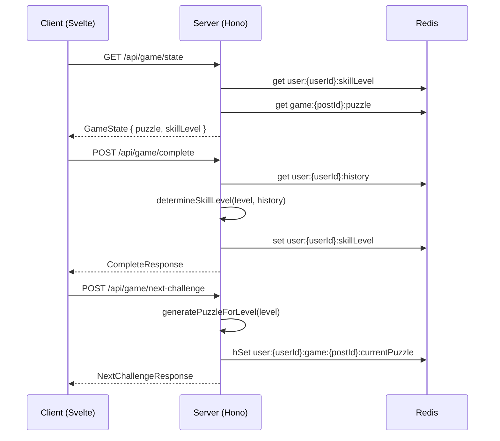
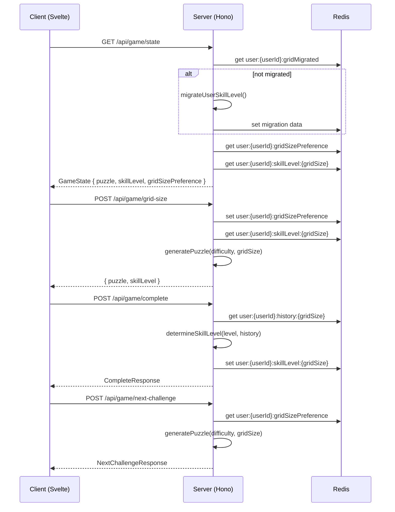
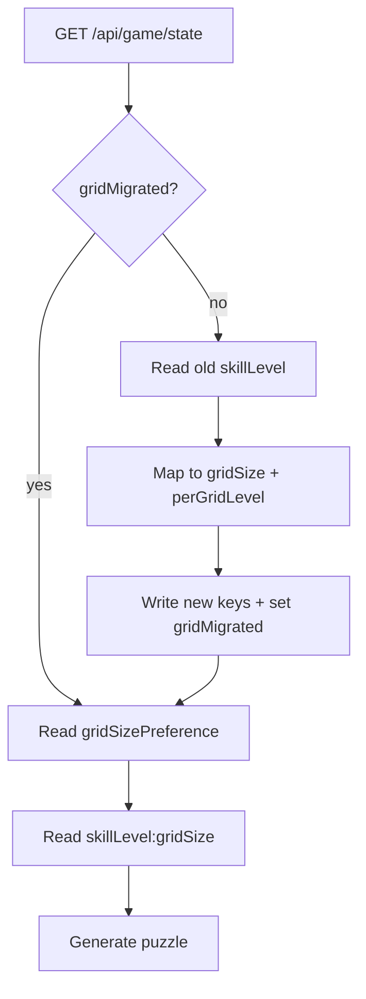

# Design Document: Grid Size Selector

## Overview

The Grid Size Selector decouples grid size from the adaptive difficulty ladder, letting players choose their preferred board size (4×4, 6×6, 8×8) independently of difficulty progression. Today, the single `DIFFICULTY_LADDER` in `constants.ts` maps 9 skill levels to fixed (gridSize, difficulty) pairs, meaning a player must grind through all 4×4 difficulties before ever seeing a 6×6 board. This change introduces:

1. A **per-grid difficulty ladder** — each grid size has its own 4-level progression (easy → medium → hard → diabolical) with independent skill tracking.
2. A **grid size preference** persisted per user in Redis, defaulting to 4×4.
3. A **UI selector** in the game header for switching grid sizes.
4. **Grid-size-aware coin rewards** with multipliers (1.0×, 1.5×, 2.0×) to incentivize larger boards.
5. **Grid-size-scoped leaderboards** for speed, while streaks remain global.
6. A **one-time migration** of existing users' global skill levels to the new per-grid structure.

The puzzle generator already supports 4×4, 6×6, and 8×8 — no changes needed there. The core work is restructuring the difficulty/adaptive system, updating server routes, adding the client selector, and migrating existing data.

## Architecture

### Current Flow



### New Flow



### Key Architectural Decisions

1. **Grid size preference is server-authoritative.** The client sends a selection; the server validates and persists it. This prevents invalid grid sizes and ensures consistency across sessions.

2. **Per-grid skill levels use separate Redis keys** (`user:{userId}:skillLevel:{gridSize}`) rather than a single hash. This matches the existing pattern for `skillLevel` and keeps reads simple.

3. **Per-grid history uses separate Redis keys** (`user:{userId}:history:{gridSize}`) for the same reason — the adaptive algorithm reads a single history array, and scoping by key avoids filtering logic.

4. **Migration runs lazily on first game state load**, not as a batch job. This avoids a migration script and handles users who haven't played in a while.

5. **The new per-grid ladder replaces `DIFFICULTY_LADDER`** in constants.ts. The old `getLevelConfig(level)` function is replaced by `getGridLevelConfig(gridSize, level)`. The old constants are kept but deprecated for backward compatibility with existing tests during transition.

## Components and Interfaces

### Shared Constants (`src/shared/constants.ts`)

**New exports:**

```typescript
/** Valid grid sizes */
export type GridSize = 4 | 6 | 8
export const VALID_GRID_SIZES: readonly GridSize[] = [4, 6, 8] as const
export const DEFAULT_GRID_SIZE: GridSize = 4

/** Per-grid difficulty ladder: each grid size has 4 levels */
export type GridDifficultyLevel = {
  level: number          // 1–4 within this grid size
  gridSize: GridSize
  difficulty: Difficulty
  expectedTime: number   // seconds
}

export const PER_GRID_LADDER: Record<GridSize, readonly GridDifficultyLevel[]>

export const PER_GRID_MAX_LEVEL = 4
export const PER_GRID_MIN_LEVEL = 1

/** Grid size coin multipliers */
export const GRID_SIZE_MULTIPLIERS: Record<GridSize, number> = {
  4: 1.0,
  6: 1.5,
  8: 2.0,
} as const

/** Get config for a (gridSize, level) pair */
export const getGridLevelConfig = (gridSize: GridSize, level: number): GridDifficultyLevel
```

**`PER_GRID_LADDER` values:**

| Grid | Level | Difficulty | Expected Time (s) |
|------|-------|------------|--------------------|
| 4×4  | 1     | easy       | 45                 |
| 4×4  | 2     | medium     | 90                 |
| 4×4  | 3     | hard       | 150                |
| 4×4  | 4     | diabolical | 210                |
| 6×6  | 1     | easy       | 120                |
| 6×6  | 2     | medium     | 210                |
| 6×6  | 3     | hard       | 360                |
| 6×6  | 4     | diabolical | 480                |
| 8×8  | 1     | easy       | 300                |
| 8×8  | 2     | medium     | 480                |
| 8×8  | 3     | hard       | 720                |
| 8×8  | 4     | diabolical | 960                |

### Shared Types (`src/shared/types.ts`)

**Modified types:**

```typescript
export type GameState = {
  puzzle: SerializedPuzzle
  tutorialCompleted: boolean
  skillLevel: number
  gridSizePreference: number  // NEW: 4, 6, or 8
  streak?: StreakData
  username?: string
}

export type CoinReward = {
  base: number
  streakBonus: number
  speedBonus: number
  dailyBonus: number
  perfectBonus: number
  loginBonus: number
  gridSizeMultiplier: number  // NEW: 1.0, 1.5, or 2.0
  total: number
}

export type NextChallengeResponse = {
  puzzle: SerializedPuzzle
  skillLevel: number
  gridSizePreference: number  // NEW
}
```

**New types:**

```typescript
export type GridSizeRequest = {
  gridSize: number  // 4, 6, or 8
}

export type GridSizeResponse = {
  puzzle: SerializedPuzzle
  skillLevel: number
  gridSizePreference: number
}
```

### Server Helpers (`src/server/lib/helpers.ts`)

**New exports:**

```typescript
/** Get user's grid size preference from Redis, defaulting to 4 */
export const getGridSizePreference = async (userId: string): Promise<GridSize>

/** Set user's grid size preference in Redis */
export const setGridSizePreference = async (userId: string, gridSize: GridSize): Promise<void>

/** Get skill level for a specific grid size */
export const getGridSkillLevel = async (userId: string, gridSize: GridSize): Promise<number>

/** Set skill level for a specific grid size */
export const setGridSkillLevel = async (userId: string, gridSize: GridSize, level: number): Promise<void>

/** Get game history for a specific grid size */
export const getGridHistory = async (userId: string, gridSize: GridSize): Promise<GameRecord[]>

/** Set game history for a specific grid size */
export const setGridHistory = async (userId: string, gridSize: GridSize, history: GameRecord[]): Promise<void>

/** Validate that a value is a valid grid size */
export const isValidGridSize = (value: unknown): value is GridSize
```

### Migration (`src/server/lib/migration.ts`)

**New file:**

```typescript
/** Migrate a user from the old global skill level to per-grid skill levels */
export const migrateUserToPerGrid = async (userId: string): Promise<{
  gridSize: GridSize
  level: number
}>

/** Check if user has been migrated */
export const isUserMigrated = async (userId: string): Promise<boolean>
```

**Migration mapping:**
- Old levels 1–3 → 4×4, mapped to per-grid levels 1–3
- Old levels 4–6 → 6×6, mapped to per-grid levels 1–3
- Old levels 7–9 → 8×8, mapped to per-grid levels 1–3

### Economy (`src/server/lib/economy.ts`)

**Modified function:**

```typescript
export const calculateCoinReward = (
  timeTaken: number,
  level: number,
  currentStreak: number,
  isDailyFirst: boolean,
  mistakes: number,
  consecutiveLoginDays: number,
  gridSize: GridSize  // NEW parameter
): CoinReward
```

The function applies `GRID_SIZE_MULTIPLIERS[gridSize]` to the base reward before summing bonuses. The `gridSizeMultiplier` field is included in the returned `CoinReward` for client display.

### Server Routes (`src/server/routes/game.ts`)

**New endpoint:**

- `POST /api/game/grid-size` — Accepts `{ gridSize: number }`, validates, persists preference, generates a new puzzle at the selected grid size and the user's skill level for that size, returns `GridSizeResponse`.

**Modified endpoints:**

- `GET /api/game/state` — Runs migration if needed. Reads `gridSizePreference`. For non-challenge posts, uses preference to generate puzzle. Returns `gridSizePreference` in response.
- `POST /api/game/complete` — Reads grid size from the completed puzzle. Updates `skillLevel:{gridSize}` and `history:{gridSize}`. Passes `gridSize` to `calculateCoinReward`. Records speed to `leaderboard:speed:{date}:{gridSize}`.
- `POST /api/game/next-challenge` — Reads `gridSizePreference`. Generates puzzle at that grid size. Records skip in `history:{gridSize}`.
- `GET /api/game/leaderboard` — For speed type, reads from `leaderboard:speed:{date}:{gridSize}` using the user's preference.
- `POST /api/game/share` — Includes grid size label in comment text (already has `gridSize` in `ShareRequest`).
- `POST /api/game/challenge` — Includes grid size in challenge post title.

### Client Components

**New component: `GridSizeSelector.svelte`**

A row of three toggle buttons (4×4, 6×6, 8×8) displayed in the game header. The active size is visually highlighted. Tapping a different size calls `POST /api/game/grid-size` and loads the returned puzzle.

**Modified components:**

- `App.svelte` — Tracks `gridSizePreference` state. Passes it to `GameView`. Handles grid size change callback.
- `GameView.svelte` — Renders `GridSizeSelector` in the header. Hides it when playing a challenge post (grid size is fixed). Passes change handler up to `App`.

## Data Models

### Redis Key Schema

| Key Pattern | Type | Description |
|-------------|------|-------------|
| `user:{userId}:gridSizePreference` | string | `"4"`, `"6"`, or `"8"`. Default: `"4"` |
| `user:{userId}:skillLevel:{gridSize}` | string | `"1"` to `"4"`. Per-grid skill level |
| `user:{userId}:history:{gridSize}` | string (JSON) | `GameRecord[]` for adaptive algorithm, per grid size |
| `user:{userId}:gridMigrated` | string | `"true"` if migration has run |
| `user:{userId}:consecutiveSkips:{gridSize}` | string | Skip counter, per grid size |
| `leaderboard:speed:{date}:{gridSize}` | sorted set | Daily speed leaderboard per grid size |

**Existing keys that remain unchanged:**
- `user:{userId}:streak:current` / `longest` / `lastDate` — streaks are global
- `user:{userId}:economy` — economy hash is global
- `leaderboard:streak` — global streak leaderboard
- `leaderboard:coins` — global coins leaderboard
- `game:{postId}:puzzle` — challenge puzzles keep their baked-in grid size

**Deprecated keys (read during migration, then ignored):**
- `user:{userId}:skillLevel` — old global skill level
- `user:{userId}:history` — old global history
- `user:{userId}:consecutiveSkips` — old global skip counter

### Migration Data Flow



**Old level → New mapping:**

| Old Level | Grid Size | Per-Grid Level |
|-----------|-----------|----------------|
| 1         | 4×4       | 1              |
| 2         | 4×4       | 2              |
| 3         | 4×4       | 3              |
| 4         | 6×6       | 1              |
| 5         | 6×6       | 2              |
| 6         | 6×6       | 3              |
| 7         | 8×8       | 1              |
| 8         | 8×8       | 2              |
| 9         | 8×8       | 3              |


## Correctness Properties

*A property is a characteristic or behavior that should hold true across all valid executions of a system — essentially, a formal statement about what the system should do. Properties serve as the bridge between human-readable specifications and machine-verifiable correctness guarantees.*

### Property 1: Grid size validation rejects all non-standard sizes

*For any* value that is not exactly 4, 6, or 8, `isValidGridSize` SHALL return `false`. *For any* value in {4, 6, 8}, it SHALL return `true`.

**Validates: Requirements 1.4**

### Property 2: Per-grid ladder completeness and ordering

*For any* valid grid size (4, 6, or 8), `PER_GRID_LADDER[gridSize]` SHALL contain exactly 4 entries with levels 1–4, difficulties in the order [easy, medium, hard, diabolical], and each entry SHALL have a positive `expectedTime` that is strictly increasing with level.

**Validates: Requirements 2.1, 2.5**

### Property 3: Skill level clamping within grid bounds

*For any* valid grid size and *any* integer level (including values below 1 and above 4), `getGridLevelConfig(gridSize, level)` SHALL return a config with level clamped to the range [1, PER_GRID_MAX_LEVEL].

**Validates: Requirements 5.5**

### Property 4: Coin reward scales monotonically with grid size

*For any* valid completion parameters (timeTaken, level, streak, isDailyFirst, mistakes, consecutiveLoginDays), the coin reward total for grid size 6 SHALL be greater than or equal to the total for grid size 4, and the total for grid size 8 SHALL be greater than or equal to the total for grid size 6, when all other parameters are held constant.

**Validates: Requirements 6.1, 6.2**

### Property 5: Coin reward total is always an integer

*For any* valid completion parameters and *any* valid grid size, `calculateCoinReward(...).total` SHALL be an integer (i.e., `Number.isInteger(total)` is `true`).

**Validates: Requirements 6.3**

### Property 6: Migration mapping round-trip consistency

*For any* old skill level in the range [1, 9], the migration function SHALL produce a (gridSize, perGridLevel) pair where: (a) gridSize is one of {4, 6, 8}, (b) perGridLevel is in [1, 3], (c) the mapping is deterministic (same input always produces same output), and (d) old levels 1–3 map to gridSize 4, old levels 4–6 map to gridSize 6, and old levels 7–9 map to gridSize 8.

**Validates: Requirements 8.1, 8.2, 8.3**

## Error Handling

### Server-Side Errors

| Scenario | Response | Details |
|----------|----------|---------|
| Invalid grid size in `POST /api/game/grid-size` | 400 | `{ error: "Invalid grid size. Must be 4, 6, or 8." }` |
| Missing userId context | 400 | `{ error: "User ID is required" }` (existing pattern) |
| Missing postId context | 400 | `{ error: "Post ID is required" }` (existing pattern) |
| Redis read failure during migration | 500 | Log error, return 500. Migration will retry on next request since flag isn't set. |
| Redis write failure for grid preference | 500 | Log error, return 500. Client retries or falls back to current grid size. |
| Puzzle generation failure | 500 | `{ error: "Failed to generate puzzle" }`. The generator already retries up to 300 attempts internally. |

### Client-Side Error Handling

- If `POST /api/game/grid-size` fails, the selector reverts to the previous active grid size and shows no error (non-disruptive).
- If the game state response is missing `gridSizePreference`, the client defaults to 4 (backward compatibility during rollout).
- Network errors during grid size switch are handled the same as existing next-challenge errors — show error view with retry button.

### Migration Edge Cases

- User with no existing `skillLevel` key: treated as level 1, migrates to 4×4 level 1.
- User with `skillLevel` outside [1, 9]: clamped to [1, 9] before mapping.
- Migration flag already set: skip migration entirely (idempotent).
- Concurrent requests triggering migration: both may write the same values — this is safe since the mapping is deterministic. The flag prevents redundant work on subsequent requests.

## Testing Strategy

### Property-Based Tests

This feature includes pure functions well-suited for property-based testing:

- **Library:** [fast-check](https://github.com/dubzzz/fast-check) (already available in the JS/TS ecosystem, works with Vitest)
- **Minimum iterations:** 100 per property test
- **Tag format:** `Feature: grid-size-selector, Property {N}: {description}`

Each correctness property from the design maps to a single property-based test:

| Property | Function Under Test | Generator Strategy |
|----------|--------------------|--------------------|
| 1: Grid size validation | `isValidGridSize` | Arbitrary integers, strings, nulls, objects |
| 2: Ladder completeness | `PER_GRID_LADDER` | Iterate over VALID_GRID_SIZES (exhaustive, not random) |
| 3: Skill level clamping | `getGridLevelConfig` | Random grid size from {4,6,8} × random integer [-10, 100] |
| 4: Coin reward scaling | `calculateCoinReward` | Random (timeTaken: 1–999, level: 1–4, streak: 0–50, isDailyFirst: bool, mistakes: 0–10, loginDays: 0–30) |
| 5: Integer total | `calculateCoinReward` | Same generator as Property 4, all three grid sizes |
| 6: Migration mapping | `migrateOldLevel` (pure mapping function) | Random integer in [1, 9] |

### Unit Tests (Example-Based)

| Area | Test Cases |
|------|-----------|
| `getGridSizePreference` | Returns 4 for new user; returns stored value for existing user |
| `getGridLevelConfig` | Returns correct config for each (gridSize, level) pair; boundary levels 1 and 4 |
| `calculateCoinReward` with grid size | 4×4 base=10 → total includes 1.0× multiplier; 6×6 base=10 → total includes 1.5× multiplier; 8×8 base=10 → total includes 2.0× multiplier |
| Migration | Level 1 → (4, 1); Level 5 → (6, 2); Level 9 → (8, 3); Already migrated → no-op |
| `POST /api/game/grid-size` | Valid sizes 4, 6, 8 succeed; Invalid size 5 returns 400; Missing body returns 400 |

### Integration Tests

| Flow | What's Verified |
|------|----------------|
| Game state with migration | Old user loads game → migration runs → correct grid size and level returned |
| Grid size switch | Change from 4→6 → new 6×6 puzzle at correct difficulty |
| Complete → adaptive update | Complete 6×6 puzzle → only skillLevel:6 updated, skillLevel:4 unchanged |
| Skip → history update | Skip on 8×8 → history:8 has skip record, history:4 unchanged |
| Speed leaderboard scoping | Complete 6×6 → entry in leaderboard:speed:{date}:6, not in :4 or :8 |
| Challenge post override | Load challenge post → uses baked-in grid size, ignores preference |

### What's NOT Tested

- Svelte component rendering (GridSizeSelector visual appearance) — verified via manual testing and svelte-autofixer
- CSS/Tailwind styling of active state indicator
- Reddit API interactions in share/challenge flows — covered by existing tests with mocks
