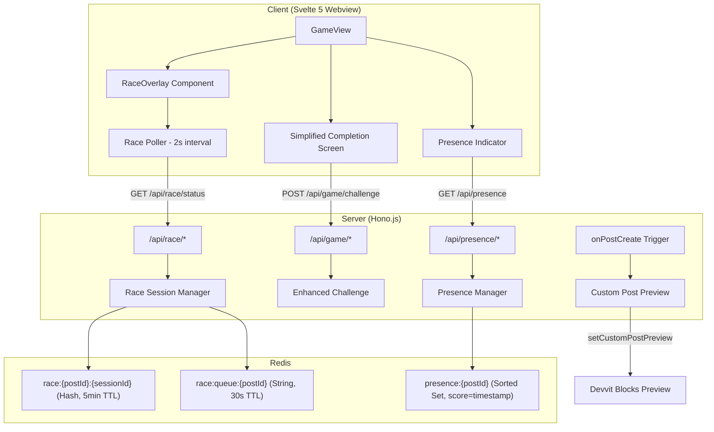
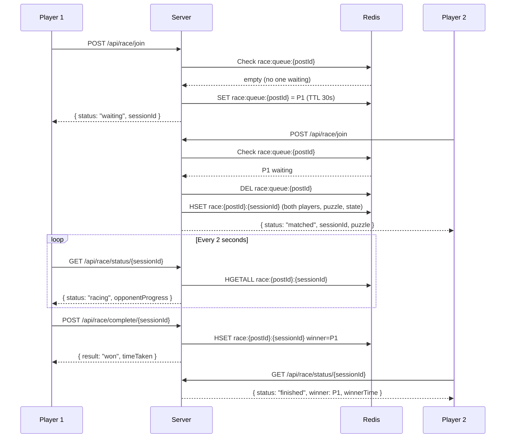
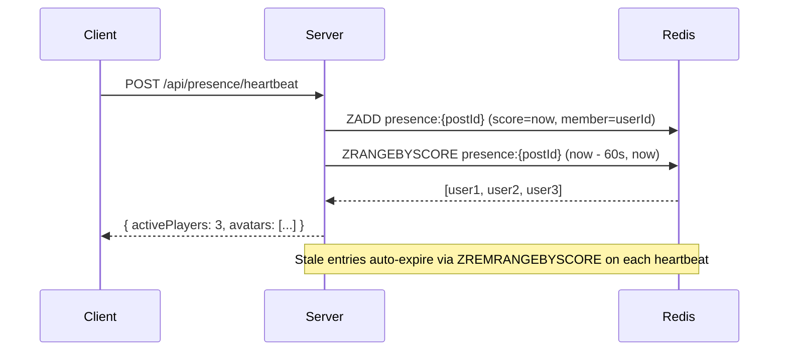
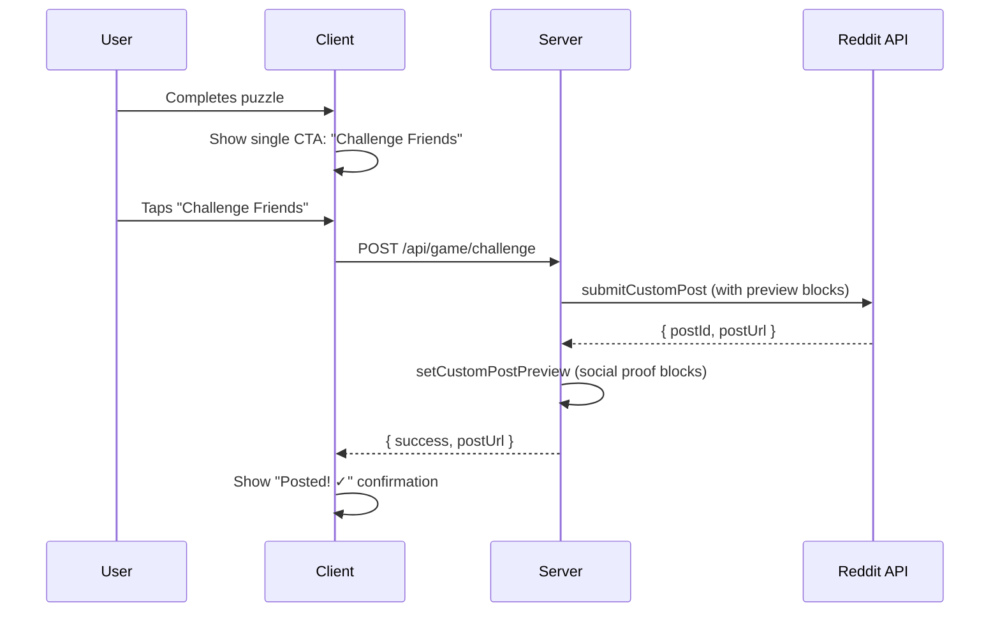

# Design Document: Social Viral Mechanics

## Overview

This feature adds three interconnected social mechanics to Urjo to achieve K-factor > 0.5: (1) a synchronous race mode where two players solve the same puzzle simultaneously via polling, (2) social presence indicators showing live activity on posts, and (3) a redesigned completion screen with a single prominent social CTA plus a custom post preview for feed engagement via `setCustomPostPreview`.

The core viral loop: completion → one-tap challenge post → feed preview with social proof → new player opens → plays → completes → creates their own challenge. Each mechanic reinforces this loop by adding urgency (race), social proof (presence), and visibility (preview).

## Architecture



## Sequence Diagrams

### Synchronous Race Flow



### Social Presence Heartbeat



### Simplified Completion → Challenge Post



## Components and Interfaces

### Component 1: Race Session Manager

**Purpose**: Manages matchmaking queue and race session lifecycle using Redis with TTLs.

**Interface**:
```typescript
interface RaceSessionManager {
  joinRace(postId: string, userId: string, gridSize: number): Promise<JoinRaceResult>
  getRaceStatus(sessionId: string, userId: string): Promise<RaceStatus>
  completeRace(sessionId: string, userId: string, timeTaken: number): Promise<RaceCompleteResult>
  abandonRace(sessionId: string, userId: string): Promise<void>
}
```

**Responsibilities**:
- Matchmaking: queue player or match with waiting player
- Session creation with puzzle generation
- Progress tracking via polling
- Winner determination and cleanup
- TTL enforcement (5min session, 30s queue)

### Component 2: Presence Manager

**Purpose**: Tracks active players on a post using a sorted set with timestamp scores.

**Interface**:
```typescript
interface PresenceManager {
  heartbeat(postId: string, userId: string): Promise<PresenceData>
  getPresence(postId: string): Promise<PresenceData>
  cleanup(postId: string): Promise<void>
}
```

**Responsibilities**:
- Record heartbeats (ZADD with timestamp score)
- Return active player count and avatar data
- Prune stale entries (older than 60s)
- Efficient reads (single ZRANGEBYSCORE)

### Component 3: Custom Post Preview Renderer

**Purpose**: Generates Devvit blocks-based preview for feed display using `setCustomPostPreview`.

**Interface**:
```typescript
interface PostPreviewRenderer {
  renderChallengePreview(data: ChallengePreviewData): DevvitBlocks
  renderDailyPreview(data: DailyPreviewData): DevvitBlocks
  renderRacePreview(data: RacePreviewData): DevvitBlocks
}
```

**Responsibilities**:
- Render social proof (avatars, times, player count)
- Show puzzle grid visual in feed
- Display compelling CTA text ("Beat 18s — 3 players racing now")
- Update preview when race/challenge state changes

### Component 4: Simplified Completion Screen

**Purpose**: Replaces the current multi-button completion overlay with a single social CTA hierarchy.

**Interface**:
```typescript
interface CompletionScreenConfig {
  getPrimaryCta(context: CompletionContext): CompletionAction
  getSecondaryCtas(context: CompletionContext): CompletionAction[]
}
```

**Responsibilities**:
- Single prominent CTA: "Challenge Friends" (creates post)
- Collapsed "More" menu for everything else
- Show preview of what the challenge post will look like
- Contextual CTA based on race result vs solo completion

## Data Models

### Race Session

```typescript
/** Stored as Redis hash: race:{postId}:{sessionId} with 5-minute TTL */
type RaceSession = {
  sessionId: string
  postId: string
  player1Id: string
  player2Id: string
  puzzleColors: string
  puzzleNumbers: string
  puzzleSolution: string
  gridSize: string // "4" | "6" | "8"
  status: 'waiting' | 'racing' | 'finished' | 'abandoned'
  startedAt: string // timestamp ms
  player1Progress: string // "0" to "100" percentage
  player2Progress: string
  player1Time: string // completion time or "0"
  player2Time: string
  winnerId: string // "" until determined
}
```

**Redis Key**: `race:{postId}:{sessionId}`
**TTL**: 300 seconds (5 minutes)

**Validation Rules**:
- sessionId is a UUID v4
- Both player IDs must be different
- gridSize must be 4, 6, or 8
- Progress values are integers 0-100
- Only one winner can be set

### Race Queue Entry

```typescript
/** Stored as Redis string: race:queue:{postId}:{gridSize} with 30s TTL */
// Value: JSON string of QueueEntry
type QueueEntry = {
  userId: string
  sessionId: string
  joinedAt: number // timestamp ms
}
```

**Redis Key**: `race:queue:{postId}:{gridSize}`
**TTL**: 30 seconds (auto-expire if no match)

### Presence Data

```typescript
/** Stored as Redis sorted set: presence:{postId} */
// Members: userId, Score: timestamp (ms)

type PresenceData = {
  activeCount: number
  players: PresencePlayer[]
  racingCount: number
}

type PresencePlayer = {
  userId: string
  username: string
  avatarUrl?: string
  isRacing: boolean
}
```

**Redis Key**: `presence:{postId}`
**Stale threshold**: 60 seconds (entries with score < now - 60000 are pruned)

### Challenge Preview Data

```typescript
/** Data passed to setCustomPostPreview for feed rendering */
type ChallengePreviewData = {
  challengerUsername: string
  challengerTime: number
  gridSize: number
  puzzleGridEmoji: string // pre-rendered emoji grid
  beatsCount: number
  attemptsCount: number
  fastestTime: number | null
  activeRacers: number
}

type DailyPreviewData = {
  puzzleNumber: number
  gridSize: number
  completionsToday: number
  activeNow: number
  fastestTime: number | null
  fastestUsername: string | null
}
```

### Simplified Completion Types

```typescript
type CompletionAction = {
  id: CompletionActionId
  label: string
  icon?: string
  style: 'primary' | 'secondary' | 'ghost'
}

type CompletionActionId =
  | 'challenge-friends'    // Creates a new challenge post (PRIMARY)
  | 'race-rematch'        // Start another race (after race win)
  | 'next-puzzle'         // Load next puzzle
  | 'view-challenge'      // Open existing challenge post
  | 'comment-result'      // Post emoji grid as comment
  | 'notify-toggle'       // Tomorrow reminder
  | 'subscribe'           // Join subreddit
  | 'missions'            // Open missions panel
  | 'achievements'        // Open achievements panel
  | 'profile'             // Open profile panel
  | 'season'              // Open season leaderboard

type CompletionContext = {
  isRaceResult: boolean
  raceWon: boolean
  timeTaken: number
  mistakes: number
  streak: number
  skillLevel: number
  hasChallenged: boolean
  challengeUrl: string | null
  hasSubscribed: boolean
}
```

## Key Functions with Formal Specifications

### Function 1: joinRace()

```typescript
const joinRace = async (
  postId: string,
  userId: string,
  gridSize: GridSize
): Promise<JoinRaceResult> => { /* ... */ }
```

**Preconditions:**
- `postId` is a valid Reddit post ID (format `t3_*`)
- `userId` is a valid Reddit user ID (format `t2_*`)
- `gridSize` is 4, 6, or 8
- User is not already in an active race session

**Postconditions:**
- If no one is queued: user is added to queue, returns `{ status: 'waiting', sessionId }`
- If someone is queued: both players matched, race session created, returns `{ status: 'matched', sessionId, puzzle }`
- Queue entry has 30s TTL
- Race session has 5min TTL
- Both players receive the same puzzle

**Loop Invariants:** N/A (no loops)

### Function 2: getRaceStatus()

```typescript
const getRaceStatus = async (
  sessionId: string,
  userId: string
): Promise<RaceStatus> => { /* ... */ }
```

**Preconditions:**
- `sessionId` exists in Redis
- `userId` is one of the two players in the session

**Postconditions:**
- Returns current race state including opponent's progress percentage
- If session expired (TTL elapsed), returns `{ status: 'expired' }`
- If opponent abandoned, returns `{ status: 'opponent_left' }`
- Read-only operation — no mutations

### Function 3: completeRace()

```typescript
const completeRace = async (
  sessionId: string,
  userId: string,
  timeTaken: number
): Promise<RaceCompleteResult> => { /* ... */ }
```

**Preconditions:**
- Session exists and status is 'racing'
- `userId` is a participant who hasn't already completed
- `timeTaken` > 0

**Postconditions:**
- Player's time is recorded in session hash
- If both players have completed: winner = fastest time, status = 'finished'
- If only this player completed: status remains 'racing', opponent still polling
- Winner determination is atomic (Redis transaction)
- Returns `{ won: boolean, yourTime, opponentTime? }`

### Function 4: heartbeat()

```typescript
const heartbeat = async (
  postId: string,
  userId: string
): Promise<PresenceData> => { /* ... */ }
```

**Preconditions:**
- `postId` is a valid post ID
- `userId` is a valid user ID

**Postconditions:**
- User's entry in sorted set updated with current timestamp
- Entries older than 60s are pruned (ZREMRANGEBYSCORE)
- Returns count of active players and their metadata
- Single Redis round-trip for write + prune + read (pipeline via sequential calls)

### Function 5: getSimplifiedCompletionCtas()

```typescript
const getSimplifiedCompletionCtas = (
  context: CompletionContext
): { primary: CompletionAction; secondary: CompletionAction[] } => { /* ... */ }
```

**Preconditions:**
- `context` is fully populated with valid game completion data

**Postconditions:**
- Always returns exactly one `primary` action
- Primary is "Challenge Friends" unless user already challenged (then "View Challenge")
- After a race win: primary is "Race Rematch"
- Secondary contains at most 2 visible items; rest go in "More" menu
- Pure function — no side effects

## Algorithmic Pseudocode

### Race Matchmaking Algorithm

```typescript
// POST /api/race/join
async function handleJoinRace(postId: string, userId: string, gridSize: GridSize): Promise<JoinRaceResult> {
  const queueKey = `race:queue:${postId}:${gridSize}`
  
  // Check if user is already in a race
  const activeRaceKey = `user:${userId}:activeRace`
  const existingRace = await redis.get(activeRaceKey)
  if (existingRace) {
    return { status: 'already_racing', sessionId: existingRace }
  }

  // Attempt to match with queued player
  const queuedRaw = await redis.get(queueKey)
  
  if (queuedRaw) {
    const queued: QueueEntry = JSON.parse(queuedRaw)
    
    // Don't match with yourself
    if (queued.userId === userId) {
      return { status: 'waiting', sessionId: queued.sessionId }
    }
    
    // Match found — create race session
    await redis.del(queueKey)
    const sessionId = queued.sessionId
    const puzzle = generatePuzzleForRace(gridSize)
    
    const session: RaceSession = {
      sessionId,
      postId,
      player1Id: queued.userId,
      player2Id: userId,
      puzzleColors: puzzle.colors,
      puzzleNumbers: puzzle.numbers,
      puzzleSolution: puzzle.solution,
      gridSize: gridSize.toString(),
      status: 'racing',
      startedAt: Date.now().toString(),
      player1Progress: '0',
      player2Progress: '0',
      player1Time: '0',
      player2Time: '0',
      winnerId: '',
    }
    
    await redis.hSet(`race:${postId}:${sessionId}`, session as Record<string, string>)
    await redis.expire(`race:${postId}:${sessionId}`, 300) // 5min TTL
    
    // Track active race for both players
    await redis.set(`user:${queued.userId}:activeRace`, sessionId)
    await redis.expire(`user:${queued.userId}:activeRace`, 300)
    await redis.set(`user:${userId}:activeRace`, sessionId)
    await redis.expire(`user:${userId}:activeRace`, 300)
    
    return { status: 'matched', sessionId, puzzle }
  }
  
  // No one waiting — join queue
  const sessionId = generateUUID()
  const entry: QueueEntry = { userId, sessionId, joinedAt: Date.now() }
  await redis.set(queueKey, JSON.stringify(entry))
  await redis.expire(queueKey, 30) // 30s TTL
  
  return { status: 'waiting', sessionId }
}
```

### Race Completion with Atomic Winner Determination

```typescript
// POST /api/race/complete/{sessionId}
async function handleRaceComplete(
  sessionId: string,
  postId: string,
  userId: string,
  timeTaken: number
): Promise<RaceCompleteResult> {
  const raceKey = `race:${postId}:${sessionId}`
  const session = await redis.hGetAll(raceKey)
  
  if (!session || !session.player1Id) {
    return { error: 'session_not_found' }
  }
  if (session.status === 'finished') {
    return { error: 'race_already_finished' }
  }
  
  // Determine which player completed
  const isPlayer1 = session.player1Id === userId
  const isPlayer2 = session.player2Id === userId
  if (!isPlayer1 && !isPlayer2) {
    return { error: 'not_a_participant' }
  }
  
  const timeField = isPlayer1 ? 'player1Time' : 'player2Time'
  const progressField = isPlayer1 ? 'player1Progress' : 'player2Progress'
  const opponentTimeField = isPlayer1 ? 'player2Time' : 'player1Time'
  
  // Record completion
  await redis.hSet(raceKey, {
    [timeField]: timeTaken.toString(),
    [progressField]: '100',
  })
  
  // Check if opponent already finished
  const opponentTime = parseInt(session[opponentTimeField] ?? '0', 10)
  
  if (opponentTime > 0) {
    // Both finished — determine winner
    const winnerId = timeTaken <= opponentTime ? userId : (isPlayer1 ? session.player2Id : session.player1Id)
    await redis.hSet(raceKey, { status: 'finished', winnerId: winnerId ?? '' })
    
    // Cleanup active race markers
    await redis.del(`user:${session.player1Id}:activeRace`)
    await redis.del(`user:${session.player2Id}:activeRace`)
    
    return {
      won: winnerId === userId,
      yourTime: timeTaken,
      opponentTime,
      winnerId: winnerId ?? '',
    }
  }
  
  // Only this player finished so far
  return {
    won: false, // pending
    yourTime: timeTaken,
    opponentTime: null,
    winnerId: null,
    waitingForOpponent: true,
  }
}
```

### Presence Heartbeat with Pruning

```typescript
// POST /api/presence/heartbeat
async function handleHeartbeat(postId: string, userId: string): Promise<PresenceData> {
  const presenceKey = `presence:${postId}`
  const now = Date.now()
  const staleThreshold = now - 60_000 // 60 seconds ago
  
  // Write heartbeat
  await redis.zAdd(presenceKey, { member: userId, score: now })
  
  // Prune stale entries (older than 60s)
  await redis.zRemRangeByScore(presenceKey, 0, staleThreshold)
  
  // Set TTL on the sorted set itself (auto-cleanup if post goes inactive)
  await redis.expire(presenceKey, 300) // 5min TTL on the set
  
  // Read active players
  const activeMembers = await redis.zRange(presenceKey, staleThreshold, now, { by: 'score' })
  
  // Check which are racing
  const players: PresencePlayer[] = await Promise.all(
    activeMembers.slice(0, 10).map(async ({ member }) => {
      const activeRace = await redis.get(`user:${member}:activeRace`)
      const username = await fetchUsername(member)
      return {
        userId: member,
        username,
        isRacing: activeRace !== undefined,
      }
    })
  )
  
  return {
    activeCount: activeMembers.length,
    players,
    racingCount: players.filter(p => p.isRacing).length,
  }
}
```

## Example Usage

```typescript
// Client: Race polling loop
let pollInterval: ReturnType<typeof setInterval> | null = null

function startRacePolling(sessionId: string) {
  pollInterval = setInterval(async () => {
    const res = await fetch(`/api/race/status/${sessionId}`)
    const status: RaceStatus = await res.json()
    
    if (status.status === 'finished') {
      stopRacePolling()
      showRaceResult(status)
    } else {
      updateOpponentProgress(status.opponentProgress)
    }
  }, 2000) // Poll every 2 seconds
}

function stopRacePolling() {
  if (pollInterval) {
    clearInterval(pollInterval)
    pollInterval = null
  }
}

// Client: Presence heartbeat (every 15s while on post)
function startPresenceHeartbeat() {
  const beat = async () => {
    const res = await fetch('/api/presence/heartbeat', { method: 'POST' })
    const data: PresenceData = await res.json()
    updatePresenceUI(data)
  }
  beat() // immediate first beat
  return setInterval(beat, 15_000)
}

// Client: Simplified completion CTA
function handleCompletion(context: CompletionContext) {
  const { primary, secondary } = getSimplifiedCompletionCtas(context)
  // primary = "Challenge Friends" button (prominent)
  // secondary = ["Next Puzzle"] (smaller)
  // Everything else in "More" menu
}

// Server: Custom post preview (in onPostCreate trigger)
async function renderChallengePostPreview(postId: string, data: ChallengePreviewData) {
  // Devvit blocks-based preview for Reddit feed
  const preview = buildPreviewBlocks(data)
  await setCustomPostPreview(postId, preview)
}
```

## Correctness Properties

### Property 1: Race Fairness

∀ race sessions, both players receive identical puzzles (same colors, numbers, solution)

**Validates: Requirement 2**

### Property 2: Single Winner

∀ finished races, exactly one winnerId is set, and it equals the player with the lower timeTaken

**Validates: Requirement 2**

### Property 3: No Self-Match

∀ matchmaking attempts, player1Id ≠ player2Id in any created session

**Validates: Requirement 1**

### Property 4: TTL Enforcement

∀ race sessions, Redis key expires within 300s of creation; ∀ queue entries, key expires within 30s

**Validates: Requirement 8**

### Property 5: Presence Accuracy

∀ presence queries, returned players have heartbeat timestamp within last 60 seconds

**Validates: Requirement 4**

### Property 6: Idempotent Completion

Calling completeRace twice with the same userId does not change the winner or create duplicate records

**Validates: Requirement 2**

### Property 7: CTA Determinism

getSimplifiedCompletionCtas is a pure function — same context always produces same output

**Validates: Requirement 5**

### Property 8: No Race Condition on Winner

If both players complete within the same polling interval, the atomic write ensures exactly one winner

**Validates: Requirement 2**

## Error Handling

### Error Scenario 1: Race Session Expired

**Condition**: Player polls for status but the 5-minute TTL has elapsed
**Response**: Return `{ status: 'expired', reason: 'timeout' }` — client shows "Race timed out" and offers to start a new one
**Recovery**: Client clears race UI state, returns to normal game mode

### Error Scenario 2: Opponent Abandons Race

**Condition**: One player stops polling (closes tab, navigates away) — detected when their progress hasn't updated in 30s
**Response**: On next poll by remaining player, server marks session as `abandoned`, returns `{ status: 'opponent_left' }`
**Recovery**: Remaining player's completion still counts as a normal solve (coins, streak, etc.)

### Error Scenario 3: Queue Timeout (No Match Found)

**Condition**: Player waits 30s in queue with no opponent joining
**Response**: Queue key auto-expires via TTL. Client polls `/api/race/status` and gets `{ status: 'queue_expired' }`
**Recovery**: Client shows "No opponents found — play solo?" with option to re-queue

### Error Scenario 4: Presence Heartbeat Failure

**Condition**: Network error on heartbeat POST
**Response**: Client silently retries on next interval (15s). Presence count may be stale but gameplay is unaffected.
**Recovery**: Non-blocking — presence is informational only, never gates gameplay

### Error Scenario 5: Challenge Post Creation Failure

**Condition**: Reddit API rejects submitCustomPost (rate limit, permissions)
**Response**: Return `{ success: false, error: 'post_creation_failed' }` — client shows inline error
**Recovery**: User can retry. No partial state left in Redis (challenge creation is atomic)

## Testing Strategy

### Unit Testing Approach

- **Race matchmaking logic**: Test queue/match/expire flows with in-memory Redis (`@devvit/test`)
- **Winner determination**: Test all edge cases (simultaneous completion, single completion, timeout)
- **Presence pruning**: Test that stale entries are removed correctly
- **CTA logic**: Test `getSimplifiedCompletionCtas` as a pure function with various contexts
- **Preview data assembly**: Test that preview data is correctly built from Redis state

### Property-Based Testing Approach

**Property Test Library**: fast-check

- **Race fairness property**: For any two players matched, the puzzle in the session is identical for both
- **Winner uniqueness**: For any completed race, exactly 0 or 1 winner exists
- **Presence monotonicity**: After a heartbeat, active count is ≥ 1 (the heartbeating user)
- **CTA purity**: For any CompletionContext, calling getSimplifiedCompletionCtas twice returns identical results

### Integration Testing Approach

- **Full race flow**: Join → match → poll → complete → winner determination
- **Concurrent races**: Multiple race sessions on the same post don't interfere
- **Preview rendering**: Challenge post creation triggers correct preview blocks
- **Analytics integration**: Race completions are tracked in viral analytics

## Performance Considerations

| Operation | Redis Commands | Frequency | Concern |
|-----------|---------------|-----------|---------|
| Race poll | 1 HGETALL | Every 2s per racing player | Low — single hash read |
| Presence heartbeat | 3 (ZADD + ZREMRANGEBYSCORE + ZRANGE) | Every 15s per active player | Low — sorted set ops are O(log N) |
| Join race | 1-3 (GET + optional DEL + HSET) | Once per race attempt | Negligible |
| Complete race | 2-3 (HGETALL + HSET + optional DEL) | Once per race | Negligible |

**Storage estimate**: 
- Race session: ~500 bytes × concurrent races (max ~50 at peak) = ~25KB
- Presence set: ~100 bytes per active player per post × 100 players × 10 active posts = ~100KB
- Queue entries: ~100 bytes × concurrent queues = negligible

All ephemeral data uses TTLs — no permanent storage growth from race/presence features.

## Security Considerations

- **Server-side time tracking**: Race completion time is validated server-side (same pattern as existing puzzle completion)
- **Player identity**: userId comes from Devvit context (cannot be spoofed by client)
- **Rate limiting**: Join race endpoint should reject if user already has an active race
- **Progress spoofing**: Client-reported progress is cosmetic only — winner is determined by server-side completion time
- **Puzzle solution**: Solution is stored server-side only; client receives puzzle without solution during race

## Dependencies

- **Existing**: `@devvit/web` (server/client), Redis, Reddit API, Hono.js
- **New**: None — all features built on existing Devvit primitives
- **Devvit APIs used**: `setCustomPostPreview` (blocks-based feed preview), `submitCustomPost`, `redis.*`, `reddit.getUserById`
- **Client**: Svelte 5 reactive state for polling, `setInterval` for heartbeat/race polling
