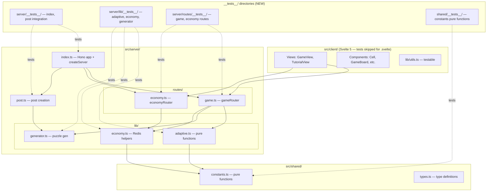
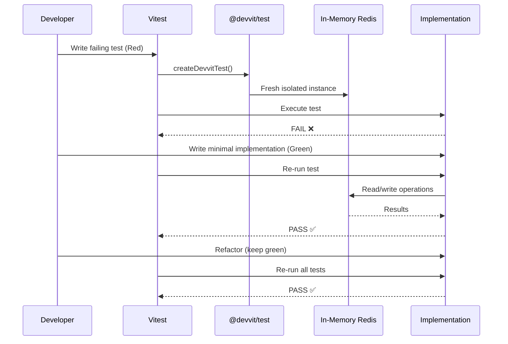
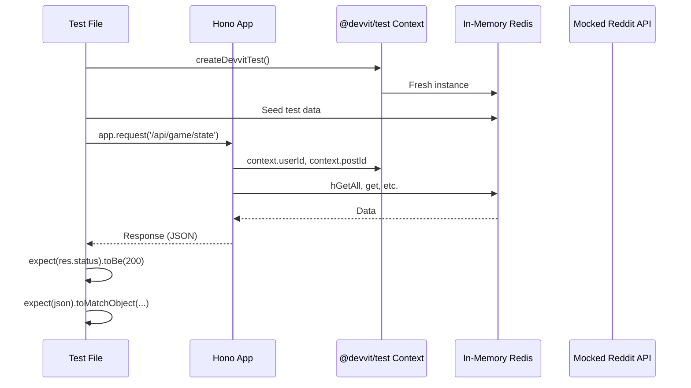

# Design Document: TDD Migration

## Overview

This migration restructures the existing Urjo Devvit app to follow strict Test-Driven Development (TDD) practices as defined in AGENTS.md and the `.agents/skills/` directory. The codebase currently has a single test file (`src/server/lib/generator.test.ts`) placed alongside its source — not in a `__tests__/` directory. Server routes, lib helpers (adaptive, economy), and shared modules have zero test coverage.

The migration involves: (1) restructuring existing tests into colocated `__tests__/` directories, (2) adding comprehensive test coverage for all server and shared modules, (3) refactoring code to align with AGENTS.md coding principles (arrow functions, functional style, ≤30 line functions), and (4) ensuring the Hono app is exported for testability via `app.request()`.

## Architecture



## Sequence Diagrams

### Test Execution Flow (TDD Cycle)



### Route Testing via app.request()



## Components and Interfaces

### Component 1: Test Infrastructure

**Purpose**: Enable route testing by exporting the Hono app instance

**Interface**:
```typescript
// src/server/index.ts — must export app for testing
export const app: Hono
```

**Current Problem**: `src/server/index.ts` does not export `app`. The `serve()` call at module level starts the server on import, which breaks test isolation.

**Solution**: Export `app` and conditionally call `serve()` only when not in test environment, or restructure so tests can import `app` without side effects.

### Component 2: Test File Structure

**Purpose**: Colocated `__tests__/` directories per the TDD skill

**New Structure**:
```
src/
├── server/
│   ├── __tests__/
│   │   ├── index.test.ts          # Hono app integration
│   │   └── post.test.ts           # Post creation
│   ├── lib/
│   │   └── __tests__/
│   │       ├── adaptive.test.ts   # Pure function tests
│   │       ├── economy.test.ts    # Redis-backed helpers
│   │       └── generator.test.ts  # Moved from lib/generator.test.ts
│   └── routes/
│       └── __tests__/
│           ├── game.test.ts       # Game route handlers
│           └── economy.test.ts    # Economy route handlers
└── shared/
    └── __tests__/
        └── constants.test.ts      # getLevelConfig, getTitleById
```

### Component 3: Code Refactoring Targets

**Purpose**: Align existing code with AGENTS.md coding principles

**Key Changes**:
- Convert `function` declarations to arrow function expressions (`const fn = (): ReturnType => {}`)
- Extract functions exceeding 30 lines into smaller composable units
- Add explicit return types on all exported functions
- Replace `class`-style patterns with pure functions
- Remove dynamic `import()` calls in `economy.ts` (use static imports)

## Data Models

### Test Context Configuration

```typescript
// Standard test setup used across all test files
import { createDevvitTest } from '@devvit/test/server/vitest'

const test = createDevvitTest({
  username: 'testuser',
  userId: 't2_testuser',
  subredditName: 'testsub',
})
```

### Redis Test Data Patterns

```typescript
// Game puzzle seeding
await redis.hSet('game:t3_post1:puzzle', {
  colors: 'rbrbbrbrrb.bbrb.',
  numbers: '1-2--3-1-2--3-1-',
  solution: 'rbrbbrbrrbbbbrbr',
  difficulty: 'easy',
  gridSize: '4',
  created: new Date().toISOString(),
})

// User economy seeding
await redis.hSet('user:t2_testuser:economy', {
  coins: '100',
  totalCoins: '500',
  totalSolves: '25',
  speedSolves: '5',
  equippedTitle: 'puzzler',
  ownedTitles: '["puzzler"]',
  dailyFirstSolve: '',
})

// Streak seeding
await redis.set('user:t2_testuser:streak:current', '5')
await redis.set('user:t2_testuser:streak:longest', '10')
await redis.set('user:t2_testuser:streak:lastDate', '2025-01-15')
```


## Algorithmic Pseudocode

### Migration Execution Algorithm

```typescript
// Phase 1: Restructure test files
// Move existing generator.test.ts → lib/__tests__/generator.test.ts
// Update import paths

// Phase 2: Make app testable
// Export Hono app from index.ts
// Guard serve() call to prevent side effects during test imports

// Phase 3: Add tests for pure functions (no Redis needed)
// shared/__tests__/constants.test.ts — getLevelConfig, getTitleById
// server/lib/__tests__/adaptive.test.ts — all exported functions

// Phase 4: Add tests for Redis-backed helpers
// server/lib/__tests__/economy.test.ts — getUserEconomy, calculateCoinReward, etc.

// Phase 5: Add route integration tests
// server/routes/__tests__/game.test.ts — all game endpoints
// server/routes/__tests__/economy.test.ts — all economy endpoints

// Phase 6: Add server integration tests
// server/__tests__/post.test.ts — createPost
// server/__tests__/index.test.ts — app-level smoke tests

// Phase 7: Refactor code to match AGENTS.md principles
// Convert function declarations → arrow expressions
// Break up functions > 30 lines
// Add explicit return types on exports
// Remove dynamic imports
```

## Key Functions with Formal Specifications

### Function 1: calculatePerformanceScore()

```typescript
export const calculatePerformanceScore = (timeTaken: number, level: number): number
```

**Preconditions:**
- `timeTaken` is a positive number
- `level` is an integer in [MIN_SKILL_LEVEL, MAX_SKILL_LEVEL]

**Postconditions:**
- Returns a number in [0.0, 1.0]
- `timeTaken === 0` → returns 1.0
- `timeTaken >= expectedTime * 2` → returns 0.0
- Result is monotonically decreasing with respect to `timeTaken`

### Function 2: determineSkillLevel()

```typescript
export const determineSkillLevel = (currentLevel: number, history: GameRecord[]): number
```

**Preconditions:**
- `currentLevel` is in [MIN_SKILL_LEVEL, MAX_SKILL_LEVEL]
- `history` is an array of valid GameRecord objects

**Postconditions:**
- Returns an integer in [MIN_SKILL_LEVEL, MAX_SKILL_LEVEL]
- Empty history → returns `currentLevel` unchanged
- Average score >= PROMOTE_THRESHOLD and currentLevel < MAX → returns `currentLevel + 1`
- Average score <= DEMOTE_THRESHOLD and currentLevel > MIN → returns `currentLevel - 1`
- Otherwise → returns `currentLevel`

### Function 3: calculateCoinReward()

```typescript
export const calculateCoinReward = (
  timeTaken: number,
  level: number,
  currentStreak: number,
  isDailyFirst: boolean
): CoinReward
```

**Preconditions:**
- `timeTaken` is a positive number
- `level` is in [MIN_SKILL_LEVEL, MAX_SKILL_LEVEL]
- `currentStreak` is a non-negative integer
- `isDailyFirst` is a boolean

**Postconditions:**
- `result.base === COIN_BASE` (always 10)
- `result.streakBonus === currentStreak * COIN_STREAK_MULTIPLIER`
- `result.speedBonus === COIN_SPEED_BONUS` if `timeTaken <= parTime`, else 0
- `result.dailyBonus === COIN_DAILY_BONUS` if `isDailyFirst`, else 0
- `result.total === base + streakBonus + speedBonus + dailyBonus`

### Function 4: getLevelConfig()

```typescript
export const getLevelConfig = (level: number): DifficultyLevel
```

**Preconditions:**
- `level` is a number (may be out of range)

**Postconditions:**
- Returns a valid DifficultyLevel from DIFFICULTY_LADDER
- Input is clamped to [MIN_SKILL_LEVEL, MAX_SKILL_LEVEL]
- `getLevelConfig(0)` returns level 1 config
- `getLevelConfig(99)` returns level 6 config

### Function 5: parseHistory()

```typescript
export const parseHistory = (json: string | null | undefined): GameRecord[]
```

**Preconditions:**
- `json` may be null, undefined, empty string, invalid JSON, or valid JSON

**Postconditions:**
- Always returns a valid GameRecord array (never throws)
- null/undefined/empty → returns `[]`
- Invalid JSON → returns `[]`
- Valid JSON but not array → returns `[]`
- Valid array → filters to only valid GameRecord objects

## Example Usage

### Testing Pure Functions (shared/constants)

```typescript
import { describe, it, expect } from 'vitest'
import { getLevelConfig, getTitleById, DIFFICULTY_LADDER } from '../../shared/constants'

describe('getLevelConfig', () => {
  it('returns correct config for level 1', () => {
    const config = getLevelConfig(1)
    expect(config).toEqual({ level: 1, gridSize: 4, difficulty: 'easy', expectedTime: 10 })
  })

  it('clamps below minimum to level 1', () => {
    expect(getLevelConfig(0)).toEqual(getLevelConfig(1))
    expect(getLevelConfig(-5)).toEqual(getLevelConfig(1))
  })

  it('clamps above maximum to level 6', () => {
    expect(getLevelConfig(99)).toEqual(getLevelConfig(6))
  })
})
```

### Testing Redis-Backed Helpers (economy)

```typescript
import { createDevvitTest } from '@devvit/test/server/vitest'
import { redis } from '@devvit/web/server'
import { expect } from 'vitest'
import { getUserEconomy, saveUserEconomy, calculateCoinReward } from '../economy'

const test = createDevvitTest({ userId: 't2_testuser' })

test('getUserEconomy returns defaults for new user', async () => {
  const economy = await getUserEconomy('t2_testuser')
  expect(economy.coins).toBe(0)
  expect(economy.equippedTitle).toBe('puzzler')
  expect(economy.ownedTitles).toEqual(['puzzler'])
})

test('calculateCoinReward includes all bonuses', () => {
  const reward = calculateCoinReward(5, 1, 3, true)
  expect(reward.base).toBe(10)
  expect(reward.streakBonus).toBe(6)  // 3 * 2
  expect(reward.speedBonus).toBe(5)   // under par
  expect(reward.dailyBonus).toBe(5)
  expect(reward.total).toBe(26)
})
```

### Testing Routes via app.request()

```typescript
import { createDevvitTest } from '@devvit/test/server/vitest'
import { redis } from '@devvit/web/server'
import { expect } from 'vitest'
import { app } from '../../index'

const test = createDevvitTest({
  userId: 't2_testuser',
  postId: 't3_post1',
  subredditName: 'testsub',
})

test('GET /api/game/state returns puzzle for seeded post', async () => {
  // Seed puzzle data
  await redis.hSet('game:t3_post1:puzzle', {
    colors: 'rbrbbrbrrbbbbrbr',
    numbers: '----------------',
    solution: 'rbrbbrbrrbbbbrbr',
    difficulty: 'easy',
    gridSize: '4',
  })

  const res = await app.request('/api/game/state')
  expect(res.status).toBe(200)

  const json = await res.json()
  expect(json.puzzle).toBeDefined()
  expect(json.skillLevel).toBe(1)
})
```

## Correctness Properties

*A property is a characteristic or behavior that should hold true across all valid executions of a system — essentially, a formal statement about what the system should do. Properties serve as the bridge between human-readable specifications and machine-verifiable correctness guarantees.*

### Property 1: Level config clamping

*For any* integer level (including negatives, zero, and values far exceeding the maximum), `getLevelConfig(level)` should return a DifficultyLevel whose level field is in [MIN_SKILL_LEVEL, MAX_SKILL_LEVEL].

**Validates: Requirement 3.1**

### Property 2: Performance score bounded output

*For any* positive timeTaken and any valid level in [1, 6], `calculatePerformanceScore(timeTaken, level)` should return a number in [0.0, 1.0].

**Validates: Requirement 3.4**

### Property 3: Skip score bounded output

*For any* non-negative timeSpent and any valid level in [1, 6], `calculateSkipScore(timeSpent, level)` should return a number in [-0.5, -0.2].

**Validates: Requirement 3.5**

### Property 4: Skill level never escapes valid range

*For any* currentLevel and any array of GameRecord objects (including empty), `determineSkillLevel(currentLevel, history)` should return an integer in [MIN_SKILL_LEVEL, MAX_SKILL_LEVEL].

**Validates: Requirements 3.7, 3.8**

### Property 5: Force demotion threshold

*For any* non-negative integer consecutiveSkips, `shouldForceDemotion(consecutiveSkips)` should return true if and only if consecutiveSkips >= CONSECUTIVE_SKIP_THRESHOLD.

**Validates: Requirement 3.9**

### Property 6: History size cap

*For any* history array and any valid GameRecord, `addGameRecord(history, record)` should return an array whose length is at most HISTORY_SIZE and that contains the new record.

**Validates: Requirement 3.10**

### Property 7: Parse history robustness and filtering

*For any* string (including random garbage, valid JSON non-arrays, and arrays with mixed valid/invalid entries), `parseHistory(input)` should never throw and should return an array where every element matches the GameRecord shape.

**Validates: Requirements 3.12, 3.13**

### Property 8: Coin reward algebraic invariant

*For any* positive timeTaken, valid level in [1, 6], non-negative currentStreak, and boolean isDailyFirst, the CoinReward returned by `calculateCoinReward` should satisfy: total === base + streakBonus + speedBonus + dailyBonus, where speedBonus equals COIN_SPEED_BONUS when timeTaken <= parTime (else 0), and dailyBonus equals COIN_DAILY_BONUS when isDailyFirst is true (else 0).

**Validates: Requirements 4.1, 4.2, 4.3**

### Property 9: Economy save/load round-trip

*For any* valid partial UserEconomy object, saving it via `saveUserEconomy` and then loading via `getUserEconomy` should return data that includes the saved fields with their original values.

**Validates: Requirement 4.5**

### Property 10: Generated puzzles satisfy constraints

*For any* puzzle produced by `generatePuzzle()`, the solution should be balanced (equal red and blue per row/column), have no adjacent identical rows, and have no adjacent identical columns.

**Validates: Requirement 3.1** (implicitly validates puzzle generator correctness used across routes)

## Error Handling

### Scenario 1: Missing Context (userId/postId)

**Condition**: Route handler called without required context values
**Response**: `{ error: 'User ID is required' }` with HTTP 400
**Testing**: Verify routes return 400 when context is missing

### Scenario 2: Invalid Request Body

**Condition**: POST endpoint receives malformed JSON or missing fields
**Response**: `{ error: 'Invalid timeTaken' }` with HTTP 400
**Testing**: Send invalid payloads and verify error responses

### Scenario 3: Redis Data Missing

**Condition**: User has no stored data (new user)
**Response**: Return sensible defaults (level 1, 0 coins, empty history)
**Testing**: Call handlers without seeding Redis, verify defaults

### Scenario 4: Puzzle Generation Failure

**Condition**: Generator fails after MAX_GENERATION_ATTEMPTS
**Response**: Throws Error, caught by route handler → HTTP 500
**Testing**: Not directly testable (probabilistic), but error path is tested

## Testing Strategy

### Unit Testing Approach

Pure function tests with no external dependencies:
- `shared/__tests__/constants.test.ts` — `getLevelConfig`, `getTitleById`
- `server/lib/__tests__/adaptive.test.ts` — all 6 exported functions
- `server/lib/__tests__/generator.test.ts` — existing tests, relocated

### Integration Testing Approach (Redis-backed)

Using `@devvit/test` in-memory Redis:
- `server/lib/__tests__/economy.test.ts` — `getUserEconomy`, `saveUserEconomy`, `getShopItems`
- `server/__tests__/post.test.ts` — `createPost` with mocked Reddit API

### Route Testing Approach

Using `app.request()` with seeded Redis data:
- `server/routes/__tests__/game.test.ts` — all 6 game endpoints
- `server/routes/__tests__/economy.test.ts` — all 5 economy endpoints

### Property-Based Testing

**Library**: Vitest (no additional PBT library needed for this migration)

Key properties to verify:
- Performance score always in [0, 1]
- Skill level always in [1, 6]
- Coin reward total always equals sum of components
- Parse history never throws

## Dependencies

- `vitest` ^4.0.18 — test runner (already installed)
- `@devvit/test` ^0.12.13 — Devvit test harness with in-memory Redis (already installed)
- `@devvit/web` 0.12.13 — server context, redis, reddit (already installed)
- `hono` ^4.12.2 — HTTP framework (already installed)
