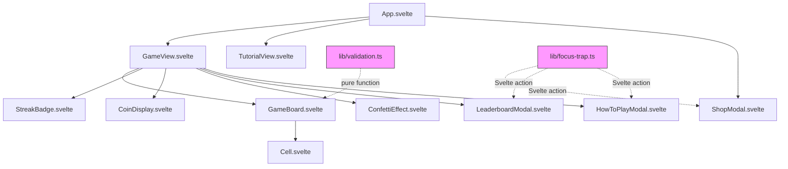

# Design Document: UI Critique Improvements

## Overview

This design addresses 10 UI improvements identified in a design critique of the Urjo puzzle game. The changes span completion screen hierarchy, header layout, wrong-move validation feedback, modal accessibility, empty/error states, and several targeted component fixes. All work is confined to the `src/client/` layer — no server changes required.

The guiding principle is **less is more**: strip clutter from the completion overlay, make the header icon-driven, surface validation errors as pure-function-driven highlights, and lock focus inside modals. Each change is scoped to a single component or a small shared utility, keeping diffs small and testable.

## Architecture

The existing architecture remains unchanged. All 10 requirements are client-side Svelte component modifications or new utility functions.



New files (pink):
- `src/client/lib/validation.ts` — pure validation function for row/column constraint checking
- `src/client/lib/focus-trap.ts` — reusable Svelte action for focus trapping

## Components and Interfaces

### 1. Completion Overlay (GameView.svelte)

**Current:** 7+ elements in the overlay — streak as large text, mini leaderboard, share, upvote prompt, restart, cross-promo.

**New layout (top to bottom):**
1. Coin reward summary (with inline streak badge if active)
2. "Next Challenge" button (primary CTA, full-width filled)
3. Secondary actions row: "Share to Comments" + "Restart" (outlined/text-only)

**Removed:** mini leaderboard preview, upvote prompt, cross-promo text, large streak text block.

**Props change:** Add `timeTaken: number` prop to GameView so the footer can display solve time.

### 2. Header (GameView.svelte)

**Current:** "How to Play" and "New Puzzle" are text links. StreakBadge pulses. CoinDisplay shows totalCoins.

**Changes:**
- Replace text links with icon-only buttons (`CircleHelp` for How to Play, `Shuffle` for New Puzzle) with `aria-label` attributes
- All interactive elements get `min-w-[44px] min-h-[44px]` for touch targets
- Use `gap-2` and `flex-shrink-0` to prevent overlap at 300px viewport

### 3. StreakBadge.svelte

**Changes:**
- Remove `animate-pulse` class entirely
- When `currentStreak === 0`, render only the 🔥 icon (no "Start your streak!" text)
- Keep the "Best: X" subtitle when applicable

### 4. Validation Feedback — `src/client/lib/validation.ts`

New pure function:

```typescript
type ValidationResult = {
  violatedRows: Set<number>
  violatedCols: Set<number>
}

const validateGrid = (grid: Grid, gridSize: number): ValidationResult
```

Logic: For each row and column, count red and blue cells. If either count exceeds `gridSize / 2`, add that index to the violated set. This is a pure function with no side effects.

### 5. GameBoard.svelte — Validation Display

**New props:** `violatedRows: Set<number>`, `violatedCols: Set<number>`

Cells in violated rows/columns receive a subtle red border ring (`ring-2 ring-red-400/40`) that doesn't obscure content. The parent (GameView) calls `validateGrid` on every cell change and passes results down.

### 6. Cell.svelte

**New prop:** `gridSize: number`

When `gridSize === 6`, the number overlay uses `text-xl` instead of `text-3xl`. Also accepts `hasError: boolean` prop for validation ring styling.

### 7. Focus Trap — `src/client/lib/focus-trap.ts`

Svelte action signature:

```typescript
const focusTrap: Action<HTMLElement, { enabled: boolean }> => {
  // On mount: find first focusable, focus it, store previous activeElement
  // Keydown handler: Tab/Shift+Tab cycle within container, Escape calls onClose
  // On destroy: restore focus to trigger element
}
```

Applied to all three modals: ShopModal, LeaderboardModal, HowToPlayModal.

### 8. HowToPlayModal.svelte

**New prop:** `gridSize: number`

Color count computed as `gridSize / 2`. Template interpolates: `"Fill each row and column with exactly {count} red and {count} blue circles"`.

### 9. CoinDisplay.svelte

**Remove:** `totalCoins` prop and the conditional `({totalCoins})` rendering block.

### 10. ConfettiEffect in TutorialView.svelte

**Remove** the `<ConfettiEffect />` mount from TutorialView. Confetti only fires in GameView on puzzle completion. GameView already guards with `{#if isCompleted}` — no change needed there. Add a `hasFiredConfetti` flag in GameView to prevent duplicate triggers on re-render.

### 11. Footer (GameView.svelte)

**Change:** When `isCompleted`, display `"Solved in {timeTaken}s"` instead of empty space.

### 12. Empty/Error States

- **App.svelte error view:** Add suggestion text "Check your connection and try again" below the error message.
- **ShopModal empty state:** Replace "No titles available" with "Titles unlock as you solve puzzles and build streaks. Keep playing!"
- **LeaderboardModal empty state:** Replace "No entries yet. Be the first!" with "Solve puzzles to earn your spot on the leaderboard."
- **LeaderboardModal error state:** Add a "Retry" button that calls `fetchLeaderboard()`.

## Data Models

No new data models are introduced. All changes operate on existing types:

- `Grid` (`Cell[][]`) — consumed by the new `validateGrid` pure function
- `CellColor` (`'red' | 'blue' | null`) — used in validation counting
- `StreakData` — read-only in StreakBadge (no changes to shape)
- `CoinReward` — displayed in the streamlined completion overlay (no changes to shape)

The `ValidationResult` type is the only new type, local to `src/client/lib/validation.ts`:

```typescript
export type ValidationResult = {
  violatedRows: Set<number>
  violatedCols: Set<number>
}
```


## Correctness Properties

*A property is a characteristic or behavior that should hold true across all valid executions of a system — essentially, a formal statement about what the system should do. Properties serve as the bridge between human-readable specifications and machine-verifiable correctness guarantees.*

### Property 1: Row and column violation detection

*For any* grid of size N×N (where N is 4 or 6) and *for any* row or column in that grid, `validateGrid` returns that row index in `violatedRows` (or column index in `violatedCols`) if and only if the count of red or blue cells in that row (or column) exceeds `N / 2`.

**Validates: Requirements 3.1, 3.2, 3.5**

### Property 2: Violation correction removes indicator

*For any* grid that has a violated row or column, if a cell change reduces the over-represented color count in that row/column to at most `gridSize / 2`, then calling `validateGrid` on the updated grid shall no longer include that row/column in the violated set.

**Validates: Requirements 3.4**

### Property 3: Color count derived from grid size

*For any* even positive integer `gridSize`, the color count displayed in HowToPlayModal shall equal `gridSize / 2`.

**Validates: Requirements 6.2, 6.3, 6.4**

### Property 4: Confetti fires at most once per completion

*For any* sequence of re-renders after a puzzle is marked completed, the confetti effect shall be triggered exactly once — subsequent renders with `isCompleted = true` shall not fire additional confetti.

**Validates: Requirements 9.3**

### Property 5: Footer displays solve time on completion

*For any* non-negative integer `timeTaken`, when `isCompleted` is true, the footer text shall equal `"Solved in {timeTaken}s"`.

**Validates: Requirements 10.1, 10.2**

## Error Handling

| Scenario | Current Behavior | New Behavior |
|----------|-----------------|-------------|
| Game fails to load | Shows "Error: {message}" + Retry button | Add suggestion text: "Check your connection and try again" |
| ShopModal empty | "No titles available" | "Titles unlock as you solve puzzles and build streaks. Keep playing!" |
| LeaderboardModal empty | "No entries yet. Be the first!" | "Solve puzzles to earn your spot on the leaderboard." |
| LeaderboardModal fetch error | Shows error text only | Show error text + "Retry" button calling `fetchLeaderboard()` |
| Validation on incomplete grid | N/A | `validateGrid` gracefully handles `null` color cells (counts only non-null) |

All error handling remains client-side. No new error types or server-side changes.

## Testing Strategy

### Dual Testing Approach

This feature uses both unit tests and property-based tests:

- **Property-based tests** (via `fast-check`): Verify universal properties of the `validateGrid` pure function and the `gridSize / 2` computation across many random inputs. Minimum 100 iterations per property.
- **Unit tests** (via Vitest): Verify specific examples, edge cases, and component-level behaviors that aren't amenable to property testing (DOM interactions, CSS class presence, focus trap behavior).

### Property-Based Testing Configuration

- Library: `fast-check` (already compatible with Vitest)
- Minimum iterations: 100 per property test
- Each test tagged with: `Feature: ui-critique-improvements, Property {N}: {title}`
- Each correctness property is implemented by a single property-based test

### Test File Locations

| File | Tests |
|------|-------|
| `src/client/lib/__tests__/validation.test.ts` | Properties 1, 2 (validateGrid pure function) |
| `src/client/lib/__tests__/utils.test.ts` | Property 3 (color count computation — can be a trivial helper) |
| `src/client/lib/__tests__/focus-trap.test.ts` | Unit tests for focus trap action (example-based, requires jsdom) |

### Unit Test Coverage

| Requirement | What to unit test |
|-------------|-------------------|
| Req 1 (Completion Overlay) | Svelte autofixer — no unit test needed (template change) |
| Req 2 (Header) | Svelte autofixer — verify aria-labels present |
| Req 3 (Validation) | Property tests 1 & 2 cover the pure function; edge cases: empty grid, fully filled grid, single-cell grid |
| Req 4 (Focus Trap) | Unit tests: Tab cycles within container, Escape closes, focus restored on destroy |
| Req 5 (Empty/Error States) | Svelte autofixer — template text changes |
| Req 6 (HowToPlay gridSize) | Property test 3; unit examples: gridSize=4→2, gridSize=6→3 |
| Req 7 (Cell font size) | Unit examples: gridSize=4→text-3xl, gridSize=6→text-xl |
| Req 8 (CoinDisplay cleanup) | Type-check verification only (`bun run type-check`) |
| Req 9 (Confetti restriction) | Property test 4; unit example: TutorialView has no ConfettiEffect |
| Req 10 (Footer time) | Property test 5; unit example: isCompleted=false shows "Tap to cycle colors" |
