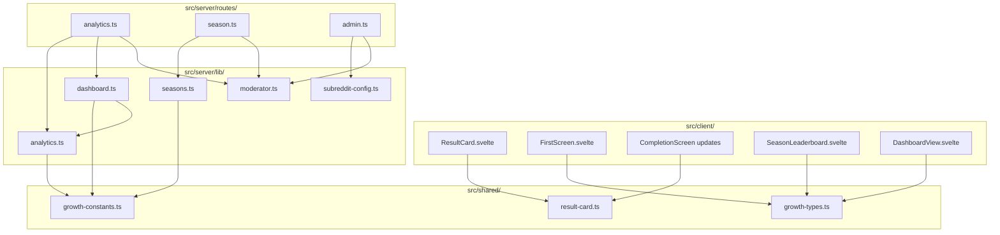

# Design Document: Urjo Growth Roadmap

## Overview

The Urjo Growth Roadmap adds distribution, analytics, virality, and competitive features to the existing Urjo puzzle game. The design follows the established architecture: pure functions in `src/server/lib/`, side effects at boundaries (Redis, API routes), shared types in `src/shared/`, and Svelte 5 components in `src/client/`.

The feature set breaks into six functional groups:

1. **Result Cards & Virality** (Reqs 1, 8, 11) — Shareable emoji-grid result cards with clipboard copy, comment posting, and a reordered completion screen that prioritizes viral actions.
2. **First-Screen Optimization** (Req 2) — A sample puzzle for new users that renders instantly and converts feed browsers into players.
3. **Analytics & Dashboard** (Reqs 3, 6, 7, 9, 12) — Server-side funnel tracking with deduplication, a growth metric dashboard with kill/scale rules, daily analytics in sticky comments, and cross-subreddit breakdowns.
4. **Mod Outreach & Config** (Reqs 4, 10, 13) — Per-subreddit configuration, moderator auth middleware, roadmap phase auto-computation, and installation tracking.
5. **Weekly Seasons** (Req 5) — 7-day competitive periods with dedicated leaderboards, season recaps, and top-player rewards.
6. **Typed Constants** (Req 14) — Kill rules, scale rules, roadmap phases, and season scoring as typed readonly arrays in `src/shared/`.

All new modules follow the existing pattern: types → constants → pure logic → Redis persistence → API routes → client components.

## Architecture

### High-Level Module Map



### Integration Points

| Existing Module | Integration |
|---|---|
| `src/server/routes/game.ts` — `POST /api/game/complete` | Call `analytics.trackCompletion()` after successful completion |
| `src/server/routes/game.ts` — `GET /api/game/state` | Call `analytics.trackPostOpen()` on load; return first-screen data for new users |
| `src/server/routes/game.ts` — cell action handler | Call `analytics.trackFirstAction()` on first cell change per session |
| `src/server/index.ts` — scheduler | Add dashboard computation and season recap to the 16:00 UTC scheduler task |
| `src/server/index.ts` — `onAppInstall` trigger | Create default subreddit config and record installation |
| `src/server/post.ts` — `createPost()` | Read subreddit config for branding emoji and default grid size |
| `src/client/App.svelte` | Route to FirstScreen for new users; pass result card data to completion screen |
| `src/client/views/GameView.svelte` | Reorder completion screen actions; add result card preview, season rank, copy button |

### New File Inventory

| File | Type | Purpose |
|---|---|---|
| `src/shared/growth-types.ts` | Types | All new types for analytics, seasons, dashboard, config, result cards |
| `src/shared/growth-constants.ts` | Constants | Kill rules, scale rules, roadmap phases, season scoring |
| `src/shared/result-card.ts` | Pure lib | `serializeResultCard()` and `parseResultCard()` — no dependencies |
| `src/server/lib/analytics.ts` | Server lib | Analytics event tracking with deduplication |
| `src/server/lib/seasons.ts` | Server lib | Season score calculation, leaderboard management |
| `src/server/lib/dashboard.ts` | Server lib | Dashboard computation, kill/scale rule evaluation |
| `src/server/lib/moderator.ts` | Server lib | Moderator auth check with Redis caching |
| `src/server/lib/subreddit-config.ts` | Server lib | Per-subreddit config CRUD |
| `src/server/routes/analytics.ts` | Route | `GET /api/analytics/daily`, `GET /api/analytics/dashboard` |
| `src/server/routes/season.ts` | Route | `GET /api/season/leaderboard`, `GET /api/season/current` |
| `src/server/routes/admin.ts` | Route | `POST /api/admin/config`, `GET /api/admin/config`, `POST /api/admin/roadmap`, `GET /api/admin/installations` |
| `src/client/components/ResultCard.svelte` | Component | Result card preview and copy button |
| `src/client/components/FirstScreen.svelte` | Component | Sample puzzle + CTA for new users |
| `src/client/components/SeasonLeaderboard.svelte` | Component | Season leaderboard modal |

## Components and Interfaces

### 1. Result Card Module (`src/shared/result-card.ts`)

Pure functions with zero dependencies. Shared between client (preview) and server (comment posting).

```typescript
/** Data needed to generate a result card */
type ResultCardData = {
  puzzleNumber: number
  gridSize: 4 | 6 | 8
  skillLevel: number       // 1–9
  colorGrid: ('red' | 'blue')[][]
  timeTaken: number        // seconds
  mistakes: number
  streak: number
}

/** Serialize a completed puzzle into the shareable text format */
const serializeResultCard = (data: ResultCardData): string => { /* ... */ }

/** Parse a result card string back into structured data, or null if invalid */
const parseResultCard = (text: string): ResultCardData | null => { /* ... */ }
```

**Format:**
```
Urjo #42 🧩 4×4 ⭐3
🟥🟦🟥🟦
🟦🟥🟦🟥
🟥🟦🟥🟦
🟦🟥🟦🟥
⏱️ 23s | 🎯 0 mistakes | 🔥 5 streak
Play at r/urjo
```

### 2. Analytics Tracker (`src/server/lib/analytics.ts`)

Handles event recording with SET NX deduplication. All counter operations use atomic `INCRBY`.

```typescript
/** Track a post open event (deduplicated per user per post per day) */
const trackPostOpen = async (date: string, postId: string, userId: string, subredditId: string): Promise<boolean> => { /* ... */ }

/** Track a first action event (deduplicated per user per post per day) */
const trackFirstAction = async (date: string, postId: string, userId: string, subredditId: string): Promise<boolean> => { /* ... */ }

/** Track a completion event (deduplicated per user per post) */
const trackCompletion = async (date: string, postId: string, userId: string, subredditId: string): Promise<boolean> => { /* ... */ }

/** Track a result card copy event (not deduplicated — counts total copies) */
const trackResultCopy = async (date: string): Promise<void> => { /* ... */ }

/** Get daily metrics for a given date */
const getDailyMetrics = async (date: string): Promise<DailyMetrics> => { /* ... */ }

/** Compute D1 return rate for a given date */
const computeD1ReturnRate = async (date: string): Promise<number> => { /* ... */ }
```

### 3. Season System (`src/server/lib/seasons.ts`)

Pure score calculation + Redis leaderboard management.

```typescript
/** Calculate season score for a puzzle completion (pure) */
const calculateSeasonScore = (timeTaken: number, parTime: number, mistakes: number): number => { /* ... */ }

/** Get current season metadata */
const getCurrentSeason = (): SeasonInfo => { /* ... */ }

/** Record a season score for a player */
const recordSeasonScore = async (seasonId: string, userId: string, score: number): Promise<void> => { /* ... */ }

/** Get season leaderboard (top N + player rank) */
const getSeasonLeaderboard = async (seasonId: string, userId: string, limit: number): Promise<SeasonLeaderboardResponse> => { /* ... */ }

/** Generate season recap data */
const getSeasonRecap = async (seasonId: string): Promise<SeasonRecap> => { /* ... */ }

/** Award season rewards to top players */
const awardSeasonRewards = async (seasonId: string): Promise<void> => { /* ... */ }
```

### 4. Dashboard Engine (`src/server/lib/dashboard.ts`)

Aggregates metrics, evaluates rules, generates suggested actions. All rule evaluation is pure.

```typescript
/** Evaluate kill rules against metrics (pure) */
const evaluateKillRules = (metrics: RollingMetrics, rules: readonly KillRule[]): Alert[] => { /* ... */ }

/** Evaluate scale rules against metrics (pure) */
const evaluateScaleRules = (metrics: RollingMetrics, rules: readonly ScaleRule[]): Alert[] => { /* ... */ }

/** Compute the current roadmap phase from start date (pure) */
const computeRoadmapPhase = (startDate: string, currentDate: string, phases: readonly RoadmapPhase[]): CurrentPhase => { /* ... */ }

/** Get suggested actions for the current phase (pure) */
const getSuggestedActions = (phase: RoadmapPhase): readonly string[] => { /* ... */ }

/** Compute and store the full dashboard for a given date */
const computeDashboard = async (date: string): Promise<DashboardData> => { /* ... */ }
```

### 5. Moderator Auth (`src/server/lib/moderator.ts`)

Hono middleware with 5-minute Redis cache.

```typescript
/** Hono middleware that checks moderator status */
const requireModerator = (): MiddlewareHandler => { /* ... */ }

/** Check if a user is a moderator (with caching) */
const isModeratorCached = async (subredditId: string, userId: string): Promise<boolean> => { /* ... */ }
```

### 6. Subreddit Config (`src/server/lib/subreddit-config.ts`)

Per-subreddit settings CRUD.

```typescript
/** Get subreddit config, creating defaults if none exists */
const getSubredditConfig = async (subredditId: string): Promise<SubredditConfig> => { /* ... */ }

/** Update subreddit config fields */
const updateSubredditConfig = async (subredditId: string, updates: Partial<SubredditConfig>): Promise<SubredditConfig> => { /* ... */ }

/** Record a new installation */
const recordInstallation = async (subredditId: string, subredditName: string, installedBy: string): Promise<void> => { /* ... */ }
```

### 7. API Routes

**Analytics Routes** (`src/server/routes/analytics.ts`):
- `GET /api/analytics/daily` — Last 30 days of daily metrics (mod-only)
- `GET /api/analytics/dashboard` — Last 14 days of dashboard data with alerts (mod-only)

**Season Routes** (`src/server/routes/season.ts`):
- `GET /api/season/current` — Current season info + player score/rank
- `GET /api/season/leaderboard` — Top 50 + player rank

**Admin Routes** (`src/server/routes/admin.ts`):
- `GET /api/admin/config` — Get subreddit config (mod-only)
- `POST /api/admin/config` — Update subreddit config (mod-only)
- `POST /api/admin/roadmap` — Set/reset roadmap start date (mod-only)
- `GET /api/admin/installations` — All installations with per-subreddit metrics (mod-only)

### 8. Client Components

**ResultCard.svelte** — Renders the emoji grid preview on the completion screen. Exposes a "Copy Result" button that calls `navigator.clipboard.writeText()` and shows a "Copied!" toast. Also exposes a "Comment Result" button that POSTs to `/api/game/share` with the result card text.

**FirstScreen.svelte** — Shown when `tutorialCompleted === false` and user has no prior solve history. Displays a 4×4 sample puzzle with 2–3 pre-colored cells, a one-line instruction, community stats, and a "Play" CTA. On tap, transitions to the actual puzzle with no loading screen.

**SeasonLeaderboard.svelte** — Modal showing the current season's top 50 players, the user's rank, and season end countdown. Reuses the existing modal pattern from `LeaderboardModal.svelte`.

## Data Models

### New Redis Keys

#### Analytics Keys

| Key Pattern | Type | TTL | Description |
|---|---|---|---|
| `analytics:{date}:post_opens` | String (counter) | 90 days | Total deduplicated post opens for the date |
| `analytics:{date}:first_actions` | String (counter) | 90 days | Total deduplicated first actions |
| `analytics:{date}:completions` | String (counter) | 90 days | Total deduplicated completions |
| `analytics:{date}:result_copies` | String (counter) | 90 days | Total result card copies (not deduplicated) |
| `analytics:{date}:completions:subreddit:{subredditId}` | String (counter) | 90 days | Per-subreddit completion count |
| `analytics:{date}:d1_return_rate` | String (float) | 90 days | Computed D1 return rate |
| `analytics:seen:{date}:{postId}:{userId}` | String ("1") | 24 hours | Post open dedup flag |
| `analytics:acted:{date}:{postId}:{userId}` | String ("1") | 24 hours | First action dedup flag |
| `analytics:completed:{postId}:{userId}` | String ("1") | 48 hours | Completion dedup flag |
| `analytics:user:{userId}:completion_dates` | Sorted Set | None | Member: date string, Score: Unix timestamp |

#### Season Keys

| Key Pattern | Type | TTL | Description |
|---|---|---|---|
| `season:{seasonId}:leaderboard` | Sorted Set | 90 days | Member: userId, Score: season points |
| `season:{seasonId}:results` | String (JSON) | None | Top 10 players + total participants |

#### Dashboard Keys

| Key Pattern | Type | TTL | Description |
|---|---|---|---|
| `dashboard:{date}` | String (JSON) | 90 days | Full dashboard data for the date |

#### Subreddit Config Keys

| Key Pattern | Type | TTL | Description |
|---|---|---|---|
| `subreddit:{subredditId}:config` | Hash | None | `postFrequency`, `defaultGridSize`, `brandingEmoji`, `welcomeMessage` |
| `installations:all` | Sorted Set | None | Member: subredditId, Score: install timestamp |
| `installation:{subredditId}` | Hash | None | `subredditName`, `installedAt`, `installedBy` |

#### Moderator Cache Keys

| Key Pattern | Type | TTL | Description |
|---|---|---|---|
| `mod:{subredditId}:{userId}` | String ("1" or "0") | 5 minutes | Cached moderator check result |

#### Roadmap Keys

| Key Pattern | Type | TTL | Description |
|---|---|---|---|
| `roadmap:startDate` | String (ISO date) | None | Roadmap start date |

#### Result Card Keys

| Key Pattern | Type | TTL | Description |
|---|---|---|---|
| `user:{userId}:resultCommented:{postId}` | String ("1") | 48 hours | Dedup flag for result card comments |

### New TypeScript Types (`src/shared/growth-types.ts`)

```typescript
// ─── Result Card ───────────────────────────────────────────────────────────────

type ResultCardData = {
  puzzleNumber: number
  gridSize: 4 | 6 | 8
  skillLevel: number
  colorGrid: ('red' | 'blue')[][]
  timeTaken: number
  mistakes: number
  streak: number
}

// ─── Analytics ─────────────────────────────────────────────────────────────────

type DailyMetrics = {
  date: string
  postOpens: number
  firstActions: number
  completions: number
  resultCopies: number
  firstActionRate: number    // firstActions / postOpens
  completionRate: number     // completions / firstActions
  d1ReturnRate: number       // computed from completion_dates sets
  estimatedDQE: number       // unique users with at least one completion
}

type RollingMetrics = {
  dqe7d: number
  firstActionRate7d: number
  completionRate7d: number
  d1ReturnRate7d: number
}

// ─── Dashboard ─────────────────────────────────────────────────────────────────

type Alert = {
  ruleId: string
  type: 'kill' | 'scale'
  message: string
  metricValue: number
  threshold: number
}

type CurrentPhase = {
  phase: number
  label: string
  dayNumber: number
  isComplete: boolean
  suggestedActions: readonly string[]
}

type DashboardData = {
  date: string
  daily: DailyMetrics
  rolling: RollingMetrics
  alerts: Alert[]
  currentPhase: CurrentPhase
  seasonParticipants: number
}

// ─── Seasons ───────────────────────────────────────────────────────────────────

type SeasonInfo = {
  seasonId: string           // ISO week, e.g. "2025-W03"
  seasonNumber: number
  startDate: string          // ISO date string
  endDate: string            // ISO date string
  isActive: boolean
}

type SeasonLeaderboardEntry = {
  rank: number
  userId: string
  username: string
  score: number
}

type SeasonLeaderboardResponse = {
  season: SeasonInfo
  entries: SeasonLeaderboardEntry[]
  playerRank: number | null
  playerScore: number
}

type SeasonRecap = {
  seasonId: string
  topPlayers: { userId: string; username: string; score: number }[]
  totalParticipants: number
}

// ─── Subreddit Config ──────────────────────────────────────────────────────────

type PostFrequency = 'once_daily' | 'twice_daily' | 'thrice_daily'

type SubredditConfig = {
  postFrequency: PostFrequency
  defaultGridSize: 4 | 6 | 8
  brandingEmoji: string
  welcomeMessage: string
}

type InstallationInfo = {
  subredditId: string
  subredditName: string
  installedAt: number
  installedBy: string
  dqeLast7Days?: number[]
}

// ─── Constants Types ───────────────────────────────────────────────────────────

type KillRule = {
  readonly id: string
  readonly metric: string
  readonly threshold: number
  readonly comparison: 'below' | 'above'
  readonly message: string
}

type ScaleRule = {
  readonly id: string
  readonly metric: string
  readonly threshold: number
  readonly comparison: 'below' | 'above'
  readonly message: string
}

type RoadmapPhase = {
  readonly phase: number
  readonly startDay: number
  readonly endDay: number
  readonly label: string
  readonly suggestedActions: readonly string[]
}

type SeasonTopReward = {
  readonly rank: number
  readonly coins: number
}
```

### New Constants (`src/shared/growth-constants.ts`)

```typescript
// ─── Season Scoring ────────────────────────────────────────────────────────────

const SEASON_BASE_POINTS = 10
const SEASON_SPEED_BONUS = 5
const SEASON_PERFECT_BONUS = 10

const SEASON_TOP_REWARDS: readonly SeasonTopReward[] = [
  { rank: 1, coins: 500 },
  { rank: 2, coins: 250 },
  { rank: 3, coins: 100 },
] as const

// ─── Kill Rules ────────────────────────────────────────────────────────────────

const KILL_RULES: readonly KillRule[] = [
  {
    id: 'kill_first_action_rate',
    metric: 'firstActionRate7d',
    threshold: 0.50,
    comparison: 'below',
    message: 'KILL: Users not understanding first screen',
  },
  {
    id: 'kill_completion_rate',
    metric: 'completionRate7d',
    threshold: 0.30,
    comparison: 'below',
    message: 'KILL: Puzzle too hard or UX broken',
  },
  {
    id: 'kill_d1_return_rate',
    metric: 'd1ReturnRate7d',
    threshold: 0.15,
    comparison: 'below',
    message: 'KILL: No return habit forming',
  },
] as const

// ─── Scale Rules ───────────────────────────────────────────────────────────────

const SCALE_RULES: readonly ScaleRule[] = [
  {
    id: 'scale_d1_return',
    metric: 'd1ReturnRate7d',
    threshold: 0.40,
    comparison: 'above',
    message: 'SCALE: Strong return habit — add more streak/reset mechanics',
  },
  {
    id: 'scale_result_copies',
    metric: 'dailyResultCopies',
    threshold: 10,
    comparison: 'above',
    message: 'SCALE: Users sharing organically — prioritize share card polish',
  },
  {
    id: 'scale_dqe_tier2',
    metric: 'dqe7d',
    threshold: 1000,
    comparison: 'above',
    message: 'SCALE: Tier 2 reached — focus on stability',
  },
] as const

// ─── Roadmap Phases ────────────────────────────────────────────────────────────

const ROADMAP_PHASES: readonly RoadmapPhase[] = [
  {
    phase: 1, startDay: 1, endDay: 14, label: 'Distribution Sprint',
    suggestedActions: [
      'Pitch to 2 subreddit mods today',
      'Polish first-screen copy',
      'Check install conversion',
    ],
  },
  {
    phase: 2, startDay: 15, endDay: 30, label: 'Retention & Polish',
    suggestedActions: [
      'Review completion rate drop-offs',
      'A/B test result card format',
      'Add social posting prompts',
    ],
  },
  {
    phase: 3, startDay: 31, endDay: 45, label: 'Scale',
    suggestedActions: [
      'Launch weekly event',
      'Push for Reddit featuring',
      'Review season engagement',
    ],
  },
  {
    phase: 4, startDay: 46, endDay: 60, label: 'Payout Maximization',
    suggestedActions: [
      'No new features',
      'Monitor stability',
      'Optimize existing flows',
    ],
  },
] as const
```


## Correctness Properties

*A property is a characteristic or behavior that should hold true across all valid executions of a system — essentially, a formal statement about what the system should do. Properties serve as the bridge between human-readable specifications and machine-verifiable correctness guarantees.*

### Property 1: Result Card Round-Trip

*For any* valid `ResultCardData` object (with `gridSize` in {4, 6, 8}, `skillLevel` in 1–9, `colorGrid` as a 2D array of 'red'|'blue' matching grid dimensions, non-negative `timeTaken`, `mistakes`, and `streak`, and positive `puzzleNumber`), `parseResultCard(serializeResultCard(data))` SHALL produce an object deeply equal to the original input.

This is the core serialization round-trip. If this holds, it implies the header format is correct (puzzleNumber, gridSize, skillLevel are recoverable), the emoji grid dimensions match the grid size, all stats fields are present and parseable, and the footer is correctly placed.

**Validates: Requirements 1.1, 1.2, 1.4, 1.7, 11.1, 11.4**

### Property 2: Invalid Result Card Strings Return Null

*For any* string that does not conform to the result card format (random strings, truncated cards, cards with invalid grid sizes, cards with non-emoji characters in the grid section), `parseResultCard(text)` SHALL return `null`.

**Validates: Requirements 11.5**

### Property 3: D1 Return Rate Computation

*For any* two sets of user IDs representing completions on day D and day D+1, the computed D1 return rate SHALL equal the size of the intersection divided by the size of the day-D set. When the day-D set is empty, the rate SHALL be 0.

**Validates: Requirements 3.6**

### Property 4: Season Boundary Computation

*For any* date, the computed season start SHALL be a Monday 00:00 UTC, the computed season end SHALL be the following Sunday 23:59:59 UTC, and the span between start and end SHALL be exactly 7 days minus 1 second. The input date SHALL always fall within the computed [start, end] range.

**Validates: Requirements 5.1**

### Property 5: Season Score Calculation

*For any* tuple of (`timeTaken` > 0, `parTime` > 0, `mistakes` >= 0), the season score SHALL equal `SEASON_BASE_POINTS` plus `SEASON_SPEED_BONUS` if `timeTaken <= parTime`, plus `SEASON_PERFECT_BONUS` if `mistakes === 0`. The score SHALL always be at least `SEASON_BASE_POINTS` and at most `SEASON_BASE_POINTS + SEASON_SPEED_BONUS + SEASON_PERFECT_BONUS`.

**Validates: Requirements 5.3**

### Property 6: Rolling Average Computation

*For any* array of 7 or more daily metric values, the 7-day rolling average SHALL equal the arithmetic mean of the last 7 values. For arrays with fewer than 7 values, the rolling average SHALL equal the mean of all available values.

**Validates: Requirements 6.2**

### Property 7: Kill and Scale Rule Evaluation

*For any* set of rolling metrics and any rule (kill or scale), the rule SHALL produce an alert if and only if: the metric value is below the threshold when `comparison` is `'below'`, or the metric value is above the threshold when `comparison` is `'above'`. The alert SHALL contain the rule's id, message, the actual metric value, and the threshold.

**Validates: Requirements 6.3, 6.4**

### Property 8: Dashboard Markdown Formatting

*For any* valid `DashboardData` object (with non-negative metrics, valid alerts, and a valid phase), the formatted markdown string SHALL contain: a table with headers for each metric, the correct metric values as strings within the table, each kill alert prefixed with "🚨", each scale alert prefixed with "🚀", and the roadmap phase number and day count.

**Validates: Requirements 7.2, 7.3, 7.4, 7.5**

### Property 9: Roadmap Phase Computation

*For any* pair of (start date, current date) where current date >= start date, the computed day number SHALL equal the number of days elapsed plus 1, and the computed phase SHALL be the phase whose `[startDay, endDay]` range contains the day number. When the day number exceeds 60, the phase SHALL be Phase 4 with `isComplete` set to true.

**Validates: Requirements 10.2, 10.3**

### Property 10: Growth Constants JSON Round-Trip

*For any* `KillRule`, `ScaleRule`, or `RoadmapPhase` object, `JSON.parse(JSON.stringify(obj))` SHALL produce an object deeply equal to the original. This verifies that all constant types use only JSON-safe primitives (strings, numbers, arrays) with no functions, undefined values, or circular references.

**Validates: Requirements 14.5, 14.6, 14.7**

## Error Handling

### API Error Strategy

All new endpoints follow the existing pattern from `src/server/routes/`:

| Condition | HTTP Status | Response Body |
|---|---|---|
| Missing `context.userId` | 401 | `{ error: 'Authentication required' }` |
| Non-moderator on admin/analytics endpoint | 403 | `{ error: 'Moderator access required' }` |
| Invalid request body (missing fields, wrong types) | 400 | `{ error: '<specific message>' }` |
| Duplicate result card comment | 400 | `{ error: 'Result already shared on this post' }` |
| Internal server error | 500 | `{ error: 'Failed to <action>' }` |

### Analytics Failure Isolation

Analytics tracking is non-blocking. If any analytics call fails (Redis timeout, dedup check error), the core game flow continues uninterrupted. This follows the existing pattern where engagement logic failures don't prevent puzzle completion.

```typescript
// Pattern: wrap analytics in try/catch, log and continue
try {
  await analytics.trackCompletion(date, postId, userId, subredditId)
} catch (err) {
  console.error('[Analytics] Completion tracking failed (non-critical):', err)
}
```

### Season System Resilience

- If season leaderboard Redis operations fail, the puzzle completion still succeeds — season scoring is non-blocking.
- If season recap generation fails during the scheduler run, the daily puzzle post is still created. The recap is posted as a separate comment in a try/catch.
- Season reward distribution failures are logged but don't block the new season from starting.

### Dashboard Computation Failures

- If any individual metric computation fails, the dashboard stores partial data with the failed metric set to `null` and a `computeErrors` array listing which metrics failed.
- Kill/scale rule evaluation only runs on successfully computed metrics — missing metrics don't trigger false alerts.

### Moderator Cache Failures

- If the Redis cache read fails, the middleware falls through to the Reddit API check (slower but correct).
- If the Reddit API check fails, the middleware returns 500 rather than silently granting or denying access.
- If the cache write fails after a successful API check, the request proceeds normally — the next request will just re-check.

### Client-Side Error Handling

- Clipboard API failure (e.g., permissions denied): Show a fallback "Select and copy" text area with the result card text pre-selected.
- Season leaderboard fetch failure: Show "Unable to load season data" with a retry button.
- First screen data fetch failure: Fall through to the normal game view (existing behavior).

## Testing Strategy

### Testing Approach

The testing strategy uses a dual approach:

1. **Property-based tests** (fast-check) for universal properties across generated inputs — the 10 correctness properties above.
2. **Example-based unit tests** (Vitest) for specific scenarios, edge cases, integration points, and UI behavior.

Property-based tests handle comprehensive input coverage through randomization. Example-based tests handle concrete scenarios, integration verification, and edge cases that property generators might not naturally produce.

### Property-Based Testing Configuration

- **Library**: `fast-check` (already in devDependencies)
- **Minimum iterations**: 100 per property test
- **Tag format**: `Feature: urjo-growth-roadmap, Property {N}: {title}`

Each correctness property maps to a single `fc.assert(fc.property(...))` call with custom generators for the domain types.

### Test File Layout

| Test File | Tests |
|---|---|
| `src/shared/__tests__/result-card.test.ts` | Properties 1, 2 + example tests for format edge cases |
| `src/server/lib/__tests__/analytics.test.ts` | Property 3 + integration tests for dedup, counters |
| `src/server/lib/__tests__/seasons.test.ts` | Properties 4, 5 + integration tests for leaderboard ops |
| `src/server/lib/__tests__/dashboard.test.ts` | Properties 6, 7, 8, 9 + example tests for phase actions |
| `src/shared/__tests__/growth-constants.test.ts` | Property 10 + smoke tests for constant structure |
| `src/server/__tests__/moderator.test.ts` | Example tests for auth middleware (401, 403, cache) |
| `src/server/__tests__/admin.test.ts` | Integration tests for admin routes |
| `src/server/__tests__/analytics-routes.test.ts` | Integration tests for analytics routes |
| `src/server/__tests__/season-routes.test.ts` | Integration tests for season routes |

### Key Generators (fast-check)

```typescript
// ResultCardData generator
const resultCardDataArb = fc.record({
  puzzleNumber: fc.integer({ min: 1, max: 99999 }),
  gridSize: fc.constantFrom(4, 6, 8) as fc.Arbitrary<4 | 6 | 8>,
  skillLevel: fc.integer({ min: 1, max: 9 }),
  colorGrid: fc.constantFrom(4, 6, 8).chain((size) =>
    fc.array(
      fc.array(fc.constantFrom('red' as const, 'blue' as const), { minLength: size, maxLength: size }),
      { minLength: size, maxLength: size }
    )
  ),
  timeTaken: fc.integer({ min: 1, max: 9999 }),
  mistakes: fc.integer({ min: 0, max: 99 }),
  streak: fc.integer({ min: 0, max: 9999 }),
})

// KillRule / ScaleRule generator
const ruleArb = fc.record({
  id: fc.string({ minLength: 1, maxLength: 50 }),
  metric: fc.string({ minLength: 1, maxLength: 50 }),
  threshold: fc.double({ min: 0, max: 10000, noNaN: true }),
  comparison: fc.constantFrom('below' as const, 'above' as const),
  message: fc.string({ minLength: 1, maxLength: 200 }),
})

// RoadmapPhase generator
const roadmapPhaseArb = fc.record({
  phase: fc.integer({ min: 1, max: 10 }),
  startDay: fc.integer({ min: 1, max: 100 }),
  endDay: fc.integer({ min: 1, max: 100 }),
  label: fc.string({ minLength: 1, maxLength: 50 }),
  suggestedActions: fc.array(fc.string({ minLength: 1, maxLength: 100 }), { minLength: 0, maxLength: 5 }),
})
```

### Example-Based Test Coverage

| Area | Key Test Cases |
|---|---|
| Result card comment dedup | First comment succeeds, second returns 400 |
| Moderator middleware | No userId → 401; non-mod → 403; mod → passes through; cached mod → no API call |
| First screen routing | New user sees sample puzzle; returning user skips to game |
| Analytics dedup | Same user/post/day → counter increments once only |
| Season score edge cases | Exactly at par time → gets speed bonus; 0 mistakes → gets perfect bonus; both → gets both |
| Subreddit config defaults | New install creates config with all default values |
| Roadmap phase boundaries | Day 1 → Phase 1; Day 14 → Phase 1; Day 15 → Phase 2; Day 60 → Phase 4; Day 61 → Phase 4 + complete flag |
| Dashboard with no data | All metrics default to 0; no alerts triggered; rolling averages handle empty arrays |
| Clipboard fallback | When clipboard API throws, fallback text area is shown |
